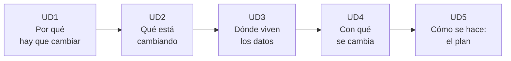

# 🔗 Digitalización Aplicada a los Sectores Productivos

> Este módulo no va de aprender una herramienta. Va de entender **por qué una empresa que llevaba cuarenta años funcionando igual, de repente tiene que cambiarlo todo** — y qué papel vas a tener tú en ese cambio.

> [!abstract] La idea que vertebra el módulo entero
> **Digitalizar no es comprar ordenadores. Es cambiar cómo se toma cada decisión dentro de una empresa.**
>
> Una oficina con equipos nuevos y los mismos papeles de siempre no está digitalizada. Una tienda de barrio con una hoja de cálculo que le dice qué producto se le acaba antes del jueves, sí ha empezado a estarlo. El tamaño no importa; lo que importa es si los datos que ya genera la empresa le sirven para decidir.

---

## 🎯 Por qué existe este módulo

> [!info] Es transversal, y eso significa algo concreto
> Da igual a qué te dediques al salir de aquí: administración, estética, informática, mantenimiento, comercio. **Todos esos sectores se están digitalizando a la vez**, y ninguno te va a preguntar si te apetece.
>
> Por eso aquí no vas a encontrar ejemplos de un solo oficio. Vas a ver una tienda de muebles, una pizzería, una gestoría, una cadena de cosmética y una fábrica — porque el proceso es el mismo en todas.

---

## 🧱 Cómo está montado: una unidad por resultado de aprendizaje

> [!important] La estructura no es un capricho
> El módulo tiene **cinco resultados de aprendizaje** en la norma. Aquí hay **cinco unidades**, una por cada uno. Ni más ni menos.
>
> Eso te da una ventaja práctica: **al terminar una unidad sabes exactamente qué resultado has demostrado**. No hay criterios repartidos entre unidades ni unidades que evalúan media cosa.

| Unidad | Título | RA | Criterios | Horas |
|---|---|:---:|:---:|---:|
| **[[UD1.1_Que_Se_Evalua\|UD1]]** | Economía lineal, economía circular y sostenibilidad | RA1 | 6 · `CE.01.a` … `CE.01.f` | 4 |
| **[[UD2.1_Que_Se_Evalua\|UD2]]** | Digitalización e Industria 4.0 | RA2 | 6 · `CE.02.a` … `CE.02.f` | 6 |
| **[[UD3.1_Que_Se_Evalua\|UD3]]** | Sistemas basados en cloud/nube | RA3 | 5 · `CE.03.a` … `CE.03.e` | 6 |
| **[[UD4.1_Que_Se_Evalua\|UD4]]** | Tecnologías digitales habilitadoras (TDH) | RA4 | 8 · `CE.04.a` … `CE.04.h` | 8 |
| **[[UD5.1_Que_Se_Evalua\|UD5]]** | Plan de transformación digital | RA5 | 8 · `CE.05.a` … `CE.05.h` | 10 |
| | | | **33** | **34** |

> [!note] De dónde salen las 34 horas
> Son las que asigna al módulo el **Decreto 114/2025, de 29 de julio, del Consell**, en la distribución horaria del ciclo (1 hora semanal). El currículo básico estatal fija **30** como mínimo y el anexo VII de ese mismo decreto indica **32**; se programa sobre la asignación real del ciclo, que es la que da las sesiones disponibles.
>
> El reparto pone más peso en **UD4 y UD5**, que son las que tienen **8 criterios cada una** — casi la mitad del módulo entre las dos.

---

## 🧭 El orden en que se ve, y por qué

> [!tip] No sigue el orden de los números
> Las unidades van en **progresión conceptual**, no en orden de RA. Primero *por qué* hay que cambiar (sostenibilidad), luego *qué* está cambiando (Industria 4.0), después *con qué* se cambia (nube y tecnologías), y al final *cómo se hace* (el plan).
>
> Por eso UD3 lleva el RA3 y UD4 el RA4, pero la unidad de tecnologías va después de la de nube aunque la nube sea, en sí misma, una tecnología habilitadora.

---

## 📄 Cómo es cada unidad por dentro

Las unidades siguen una **plantilla fija de 8 apartados**. Siempre los mismos, siempre en el mismo orden, para que sepas dónde buscar cada cosa.

| Apartado | Qué es | Cuándo se lee |
|:---:|---|---|
| **1** | Qué se te evalúa | El primer día, antes que nada |
| **2** | Dónde estamos | Para situarte: de qué viene y a dónde va |
| **3** | Fundamento | La teoría. Sin ordenador delante |
| **4** | Lo que NO es | Los malentendidos típicos, desmontados |
| **5** | Glosario y Quizlet | El vocabulario que hay que dominar |
| **6** | Caso resuelto | Un caso real, explicado paso a paso |
| **7** | Actividades | Lo que entregas |
| **8** | Ponte a prueba y cierre | Autoevaluación y lista de comprobación |

> [!success] ✅ Estado del material
> **Las cinco unidades están completas**: los 8 apartados de cada una, más su solucionario en `Solucionario/`.
>
> Escritas entre el 06/09/2026 (UD1) y el 09/09/2026 (UD2 a UD5), sobre los capítulos 1 a 5 del libro de referencia y el RD 659/2023.

---

## 📖 Vocabulario y práctica en vídeo

> [!important] Un set de Quizlet y una práctica en vídeo por unidad
> En cada unidad tienes un apartado de glosario con los términos que hay que dominar y una práctica profesional. El vocabulario se organiza en **Quizlet**; el vídeo sirve para explicar **el análisis o procedimiento seguido en la práctica**.

| Qué | Cómo se llama |
|---|---|
| El set de Quizlet | `DASP · UDn · <título de la unidad>` |
| El vídeo de la práctica | `DASP · UDn · Práctica profesional` |

> [!info] 📹 Es el único vídeo evaluable de cada unidad
> No se graba el glosario. Se presenta la práctica profesional terminada, con la voz del alumno y mostrando las evidencias que justifican sus decisiones.

---

## ⚖️ De dónde sale todo esto

> [!quote] Las tres normas que mandan, por orden
> 1. **Real Decreto 659/2023, de 18 de julio** — Anexo VI. Fija los **5 RA y los 33 criterios**, que son literales y no se pueden tocar. Modificado por el **RD 658/2024**, que confirma la duración mínima de 30 horas.
> 2. **Real Decreto 499/2024, de 21 de mayo** — remite al anexo VI para este módulo. Suprime en los ciclos afectados los módulos de FOL, EIE y FCT, e incorpora el **Proyecto intermodular**.
> 3. **Decreto 114/2025, de 29 de julio, del Consell** — currículo de la Comunitat Valenciana. Es el que fija las **34 horas** reales del módulo en el ciclo.

> [!danger] 🛑 Los criterios de evaluación son intocables
> Ni el centro ni el profesorado pueden cambiar su redacción. Por eso en el apartado 1 de cada unidad aparecen **copiados literalmente del Boletín Oficial del Estado**, no reformulados.
