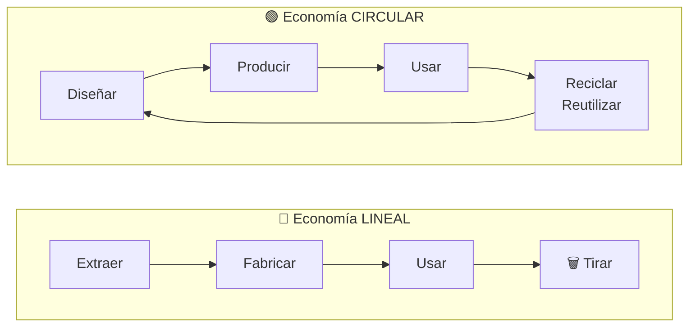

## UD1 · Apartado 3 — 📚 Fundamento

> **[Módulo: Digitalización Aplicada a los Sectores Productivos]** · **Unidad 1 de 5**
> 🧭 Índice del módulo: [[00_Indice_DASP]]
>
> **📍 Cuándo se lee:** es el contenido de la unidad. Lo vas a tener abierto casi las cuatro horas.

---

> [!abstract] 🧩 La unidad de un vistazo
> Antes de entrar en la teoría, mira qué le ocurre al mismo objeto cuando sigue una cadena lineal y cuando vuelve al ciclo productivo.

![[Imagenes/UD1_Infografia_Bento_Economia_Lineal_Circular.webp|1200]]

---

## 1 · EL PROBLEMA, ANTES QUE LA DEFINICIÓN

Piensa en unos auriculares de 15 €. Te duran ocho meses, se les va un lado, los tiras y compras otros. Has hecho eso tres veces. Nunca se te ha ocurrido abrirlos.

**Ahora piensa en quién los fabricó.** A esa empresa le interesa exactamente eso: que duren ocho meses. Si duraran diez años, vendería una vez en lugar de quince.

> [!warning] Una distinción clave para empezar
> Creer que esto va de **ecología**. No va de eso. Va de **dinero**.
>
> La economía circular no se está implantando porque las empresas se hayan vuelto buenas. Se está implantando porque **las materias primas suben de precio**, porque **tirar cuesta cada vez más caro** y porque **la ley te obliga**. La parte ecológica es la consecuencia, no la causa.

---

## 2 · LAS DOS CADENAS · `CE.01.a`

![[Imagenes/UD1_02_Bento_Dos_Cadenas.webp|1200]]

> [!tip] Los ejemplos de tu oficio están en el apartado 6.3
> Aquí vas a ver las dos cadenas en abstracto, que es como hay que entenderlas. **Cuando quieras verlas aplicadas a tu sector, salta al 6.3** y vuelve.

Todo el modelo económico de los últimos dos siglos cabe en cuatro palabras:

> [!danger] Economía lineal
> **Extraer → Fabricar → Usar → Tirar**
>
> Es una línea recta. Empieza en una mina o un campo y acaba en un vertedero. Cada producto recorre esa línea **una vez**, y al final del recorrido todo su valor se pierde.

> [!success] Economía circular
> **Diseñar → Producir → Usar → Reciclar / Reutilizar → *(vuelta al principio)***
>
> Es un círculo. Al terminar la vida útil de un producto, los componentes que sirvan **vuelven a entrar** en el ciclo productivo.

> [!important] La definición, ahora que ya sabes de qué va
> **La economía circular es un modelo que busca reducir la generación de residuos y aprovechar al máximo los recursos disponibles.** Frente a la lineal tradicional de extraer, fabricar, usar y tirar, se enfoca en **reducir, reutilizar y reciclar** los materiales para mantenerlos en el ciclo productivo el mayor tiempo posible.

**Y hay un efecto secundario que conviene que veas:** el modelo circular **neutraliza la obsolescencia programada**. Si tu negocio consiste en que el producto vuelva, ya no te interesa que se rompa.

### La diferencia está en UNA etapa

Mira las dos cadenas otra vez. Las tres primeras etapas son casi iguales. **Lo que cambia es la cuarta.** Donde una pone «tirar», la otra pone «devolver al ciclo».

Parece poco. Cambia el negocio entero: si el producto vuelve, tienes que **diseñarlo** para que se pueda desmontar. Por eso en la cadena circular la primera etapa no es «extraer» sino **«diseñar»**.

---

## 3 · LAS 10 R

![[Imagenes/UD1_03_Bento_Las_10_R.webp|1200]]

El libro las ordena de más a menos importante. No es una lista para memorizar: es una **escala de prioridad**. Reciclar está casi al final.

| # | La R | Qué significa | Ejemplo real |
|---:|---|---|---|
| 1 | **Rechazar** | No usarlo directamente | Bolsas de plástico de un solo uso |
| 2 | **Repensar** | Usarlo de otra forma, compartido | Coches, bicis y patinetes compartidos |
| 3 | **Reducir** | Producir solo lo que se va a vender | Fabricación bajo demanda: sin exceso de inventario |
| 4 | **Reutilizar** | Volver a usarlo tal cual | Envases retornables |
| 5 | **Reparar** | Arreglar lo estropeado | Los recolectores de paraguas del Japón Edo |
| 6 | **Reacondicionar** | Dejarlo como nuevo y revenderlo | Móviles y portátiles reacondicionados |
| 7 | **Remanufacturar** | Usar sus piezas en un producto nuevo | Celdas buenas de una batería estropeada |
| 8 | **Replantear** | Cambiar la función del producto | Un palé convertido en mueble |
| 9 | **Reciclar** | Deshacerlo para recuperar el material | Aluminio, vidrio, papel |
| 10 | **Recuperar** | Último recurso: sacarle energía | Incinerar para generar calor |

> [!tip] Lo que dice esta tabla y casi nadie ve
> **Reciclar es la novena de diez.** Cuando reciclas, ya has fallado ocho veces antes. El producto ya se fabricó, ya se transportó, ya se usó y ya se rompió: lo único que salvas es el material.
>
> Las erres que de verdad cambian las cosas son las de arriba, y son las más incómodas: **rechazar** y **repensar** exigen no comprar. Por eso son las que menos se practican.

> [!quote] 🇯🇵 ¿Sabías que…? · *mottainai*
> Es un concepto muy arraigado en Japón que aboga por **respetar los objetos y no desecharlos**. Fue muy influyente en el periodo Edo: entonces la gente no tiraba los paraguas rotos — **se los vendía a unos recolectores que los reparaban y los volvían a poner a la venta**.
>
> No es una moda moderna. Es una idea de hace cuatrocientos años.

> [!quote] 🍎 Recurso web · El cuero de manzana
> Un producto **vegano** fabricado con los residuos de la industria del zumo de manzana —la piel, la pulpa y el corazón—, que normalmente se tiran. Tiene las mismas características que el cuero sintético pero, al no usar derivados del petróleo, es más sostenible.
>
> 🔗 Busca el artículo **«Biotejidos o cómo convertir la piel de manzana y las hojas de piña en el cuero de moda»**, publicado en *La Vanguardia*.

> [!example] 📖 Vocabulario
> - **Obsolescencia programada** — diseñar un producto para que deje de funcionar o de ser útil pasado un tiempo, aunque podría durar más.
> - **Vida útil** — tiempo durante el que un producto cumple la función para la que se fabricó.
> - **Materia prima virgen** — material extraído de la naturaleza por primera vez, sin haber pasado antes por ningún producto.
> - **Ciclo productivo** — recorrido completo de un material desde que entra en la fábrica hasta que sale como producto.
> - **ODS** — Objetivos de Desarrollo Sostenible: los 17 objetivos que la ONU fijó en la Agenda 2030.

---

## 4 · LOS SIETE MODELOS DE EMPRESA · `CE.01.b`

![[Imagenes/UD1_04_Bento_Modelos_Empresa.webp|1200]]

Ninguna empresa es «lineal» o «circular» del todo. Están en algún punto entre las dos. El libro define **siete modelos**, ordenados aquí de peor a mejor impacto:

| Modelo | Qué hace | Impacto medioambiental |
|---|---|---|
| **Extractivo** | Explota recursos naturales (petróleo, minerales, madera) | 🔴 Deforestación, degradación del suelo, contaminación del agua, gases de efecto invernadero |
| **Producción convencional** | Produce sin tener en cuenta el impacto | 🔴 Residuos, sobreexplotación, contaminación de aire, agua y suelo |
| **Producción limpia** | Produce igual, pero minimizando el daño | 🟡 Reduce emisiones, optimiza recursos, minimiza residuos |
| **Economía circular** | Cierra el ciclo de vida del producto | 🟢 Menos materia prima virgen, menos residuos, menos presión sobre los ecosistemas |
| **Negocio verde** | Su producto **es** la solución ambiental | 🟢 Renovables, tecnologías limpias, eficiencia energética |
| **Responsabilidad social corporativa (RSC)** | Considera el impacto social y ambiental de sus decisiones | 🟢 Depende de cuánto se lo crea |
| **Servicios o recursos compartidos** | No vende productos: vende acceso | 🟢 Menos productos fabricados para el mismo servicio |

> [!warning] Cuidado con el modelo de RSC
> Es el más fácil de aparentar. Una empresa puede publicar un informe de sostenibilidad precioso y seguir siendo extractiva. **Mira lo que hace, no lo que publica.**

> [!tip] El modelo de servicios compartidos es el más radical
> Es el único que **reduce el número de productos fabricados**. Si diez personas comparten un taladro en lugar de comprar uno cada una, se han fabricado nueve taladros menos. Ninguna mejora de reciclaje consigue eso.

---

> [!quote] ⛏️ Para saber más · Minería de criptomonedas y gasto energético
> La minería mediante *proof of work* puede tener un consumo energético muy elevado. En el caso de **bitcoin**, hoy está concentrada principalmente en grandes centros de cálculo especializados.
>
> Minar consiste en meter números aleatorios y hacer **cálculos hash** —obtener un número a partir de otro— hasta dar con el bueno. Eso solo se hace de forma eficiente con equipos muy potentes.
>
> **Un dato que sitúa la evolución de bitcoin:** su minería dejó atrás las tarjetas gráficas y pasó a equipos **ASIC** (*application-specific integrated circuit*), chips fabricados exclusivamente para esa tarea. Otras criptomonedas siguieron trayectorias diferentes; Ethereum, por ejemplo, permitió minería con GPU hasta su cambio a *proof of stake* en 2022.
>
> Lo vas a necesitar en la actividad 2 del apartado 7.

## 5 · POR QUÉ IMPORTA EL RECICLAJE · `CE.01.c`

![[Imagenes/UD1_05_Bento_Importancia_Reciclaje.webp|1200]]

Cuatro razones, y solo una es ecológica:

1. **Conserva recursos escasos.** Un móvil o un portátil reúne muchos componentes y materiales diferentes. Recuperar metales y otros materiales de sus placas reduce la necesidad de extraer materia prima virgen, aunque la recuperación nunca es completa.
2. **Reduce costes de producción.** El material reciclado suele salir más barato que la materia prima virgen.
3. **Crea empleo local.** Recogida, clasificación, procesamiento y fabricación. Y es empleo que no se puede deslocalizar: la basura está donde está.
4. **Abarata la gestión de residuos.** Menos toneladas al vertedero significa menos coste para el ayuntamiento y para la empresa.

> [!quote] 🖨️ ¿Sabías que…? · Los cartuchos de tinta
> Un cartucho de tinta de impresora, según su calidad, **puede reciclarse hasta 10 veces** sin que la tinta pierda propiedades ni funcionalidad.

> [!danger] Lo que llevan dentro los aparatos que tiras
> Berilio, cadmio, plomo, PVC y retardantes de llama bromados. Los metales pesados dañan cerebro, riñones, huesos y los sistemas nervioso, sanguíneo y reproductor — y **se acumulan en el cuerpo sin que ningún proceso fisiológico pueda eliminarlos**.
>
> Cuando un móvil acaba en un vertedero incorrecto, eso no se queda quieto.

---

## 6 · PROCESOS REALES · `CE.01.d` y `CE.01.e`

![[Imagenes/UD1_06_Bento_Procesos_Reales.webp|1200]]

### 6.1 · Economía lineal en estado puro

| Sector | Proceso | Por qué es lineal |
|---|---|---|
| **Moda rápida** | Ropa barata en grandes cantidades | Mucha agua, algodón y química. Diseñada para durar poco y venir de muy lejos |
| **Envases desechables** | Botellas, envoltorios, tarrinas | Un solo uso. Nunca se recicla el 100 % de lo que se comercializa |
| **Automoción** | Coches producidos en masa | Vida útil corta para lo que podrían durar; muchos materiales se pierden al desguazar |
| **Dispositivos electrónicos** | Móviles, ordenadores, televisores | Se quedan obsoletos enseguida por el avance tecnológico. Se tiran en vez de repararse o reciclarse |
| **Agricultura convencional** | Cultivo intensivo para maximizar la cosecha | Grandes cantidades de pesticidas, herbicidas y fertilizantes que contaminan suelo y agua. Los restos de cosecha se queman en vez de servir de materia orgánica |

### 6.2 · Economía circular en la práctica

| Práctica | En qué consiste | Ejemplo |
|---|---|---|
| **Diseño para el reciclaje** | Elegir materiales que se separen fácil | Aluminio y vidrio se reciclan mucho mejor que los plásticos |
| **Reacondicionamiento** | Reparar estética y funcionalmente para revender | Móviles, tabletas y portátiles reacondicionados |
| **Alquiler y uso compartido** | Acceder al producto sin poseerlo | Herramientas, vehículos, maquinaria |
| **Ecodiseño** | Diseñar pensando en todo el ciclo de vida, de la materia prima al final | Mochilas de material reciclado, duraderas, fáciles de desmontar y sin embalaje |
| **Segunda mano** | Dar salida a lo que alguien ya no usa | Además de alargar la vida del producto, crea empleo y oportunidades de negocio |

### 6.3 · Y ahora, lo tuyo

> [!info] Por qué esta tabla es la importante de toda la unidad
> Las dos tablas de arriba hablan de fábricas de coches y de ropa. Están bien para entender el concepto, pero **tú no vas a trabajar ahí**. Esta sí va de tu oficio.
>
> Busca tu sector. Vas a ver que **el proceso lineal ya lo conoces**: es cómo se hacen hoy las cosas donde vas a acabar trabajando.

| Sector | Cómo se hace hoy (lineal) | La versión circular |
|---|---|---|
| **Oficina, gestoría, asesoría** | Todo se imprime por duplicado, se archiva en papel y a los seis años se destruye. Los tóneres se tiran al gastarse | Gestión documental digital con firma electrónica. Tóneres recargables que devuelve el proveedor. El papel imprescindible, reciclado y a doble cara |
| **Comercio y almacén** | Cada pedido llega con su caja, su plástico de burbujas y sus flejes. Todo va al contenedor al abrirlo | Envases retornables entre proveedor y tienda. Cartón que vuelve al circuito. Compra agrupada para reducir viajes |
| **Imagen personal: peluquería y estética** | Toallas y capas de un solo uso, envases pequeños de producto, aparatos que se sustituyen enteros cuando falla una pieza | Textil lavable reutilizable. Producto a granel con dosificador recargable. Aparatología con piezas de repuesto y servicio técnico |
| **Informática y redes** | Se renueva el parque de equipos cada cuatro años y los viejos se retiran completos | Se amplía memoria y se cambia el disco: el equipo aguanta el doble. Lo retirado se reacondiciona o va a un gestor autorizado |
| **Sanidad y farmacia** | Instrumental y textil de un solo uso por protocolo. Envases de medicación que se tiran vacíos | Instrumental esterilizable donde el protocolo lo permite. Punto SIGRE para envases y restos de medicamentos |
| **Hostelería** | Monodosis de azúcar, sal y aceite. Comida no servida que acaba en la basura | Dosificadores rellenables. Aprovechamiento y donación del excedente. Compostaje del residuo orgánico |
| **Mantenimiento y automoción** | Se sustituye la pieza completa y la vieja se desecha | Se remanufactura: la pieza vuelve a fábrica, se reacondiciona y se revende con garantía |

> [!tip] 💡 Fíjate en el patrón, que es siempre el mismo
> En los siete sectores, la versión circular hace **una de estas tres cosas**: alarga la vida de algo que ya existe, devuelve el material al circuito en vez de tirarlo, o cambia el producto por un servicio.
>
> **No hace falta memorizar la tabla.** Hace falta que reconozcas cuál de las tres se está aplicando cuando lo veas.

> [!warning] ⚠️ Que no te engañe lo pequeño
> «Cambiar los tóneres» suena a poca cosa al lado de una fábrica de coches. Pero en España la mayoría del tejido productivo son **empresas pequeñas**, y es justo ahí donde vas a trabajar tú.
>
> La economía circular en tu sector **no va a llegar en forma de plan estratégico**. Va a llegar en forma de decisiones pequeñas que alguien tiene que ver. Ese alguien puedes ser tú.

---

> [!important] 🛑 En la actividad 3 no vale copiar NINGUNA de estas tres tablas
> Los criterios `CE.01.d` y `CE.01.e` piden **procesos reales**. Las de 6.1 y 6.2 son las del libro; la de 6.3 te la doy yo. **Ninguna de las tres cuenta como respuesta tuya.**
>
> Lo que tienes que traer son **dos procesos que hayas visto tú**: en el sitio donde has hecho prácticas, en el negocio de un familiar, en la tienda de tu calle. Uno lineal y uno circular, con el nombre del sitio y qué hacen exactamente.

---

## 7 · MATERIALES: LOS QUE SÍ Y LOS QUE NO

![[Imagenes/UD1_07_Bento_Materiales.webp|1200]]

| | Sostenibles | Problemáticos |
|---|---|---|
| **Metales** | Metal reciclado (sobre todo aluminio), chapa troquelada, acero dulce | Oro, plata, platino, plomo, mercurio, cadmio, cromo hexavalente |
| **Madera y vegetales** | Bambú, maíz, madera certificada, madera reciclada | Teca, caoba, ébano, iroco, palo de rosa, zebrano, araucaria, palo de Brasil |
| **Plásticos** | Bioplásticos PLA y PHA | PVC, epoxi, policarbonato, ABS |

---

> [!quote] 🔋 Para saber más · Las baterías de litio
> El litio ha sido clave en la evolución tecnológica de los últimos años, y su coste ha ido bajando, así que se usa de forma masiva. Pero **su impacto ambiental preocupa**.
>
> Y hay un motivo práctico para reciclarlas: **cuando una batería se estropea, no todas sus celdas han dejado de funcionar.** Las que están bien se pueden aprovechar en otros proyectos. Eso es *remanufacturar*, la séptima R.
>
> Con el parque de vehículos eléctricos creciendo, gestionar esas baterías al final de su vida útil ya no es opcional.

> [!quote] 💶 ¿Sabías que…? · Lo caro sale barato
> Un producto fabricado **para durar** suele costar más que uno de peor calidad. Pero a largo plazo **ahorras dinero**, usas algo de mejores prestaciones y su impacto ambiental es menor.
>
> Piénsalo antes de comprar los auriculares de 15 € por cuarta vez.

> [!quote] 💧 Para saber más · Hidrógeno verde, azul y gris
> El hidrógeno es el elemento más abundante del universo, pero en la naturaleza casi nunca se encuentra separado de otros elementos. En una **pila de combustible**, su uso produce electricidad, agua y calor en el punto de consumo; el impacto total depende de cómo se haya obtenido, comprimido y transportado.
>
> Los tres tipos se distinguen por **cómo se ha obtenido**:
>
> | Tipo | Cómo se produce | CO₂ |
> |---|---|---|
> | 🟤 **Gris** *(o marrón, o negro)* | A partir de gas metano o carbón | Se genera y **no se recaptura**. Poco sostenible |
> | 🔵 **Azul** | Igual, de metano o carbón | Se captura y almacena una parte del CO₂; la proporción depende del proceso y de la instalación |
> | 🟢 **Verde** | Por **electrólisis** con energías renovables | Ninguno. Además permite **almacenar** los excedentes de renovables |
>
> El verde resuelve de paso el problema del almacenamiento: se genera con la electricidad que sobra y se guarda para usarla después.

> [!info] Cuatro términos que vas a necesitar en las actividades
> - **Batería 18650:** celda recargable de ion-litio, cilíndrica y de tamaño normalizado, utilizada en numerosos dispositivos y paquetes de baterías.
> - **Material ferromagnético:** material que puede ser atraído y separado mediante un imán; esta propiedad facilita la clasificación de residuos metálicos.
> - **Producto reacondicionado (*refurbished*):** dispositivo usado que una empresa revisa, repara cuando hace falta, prueba y vuelve a vender con unas condiciones declaradas. No es simplemente un producto de segunda mano.
> - **KPI (*key performance indicator*):** indicador medible que permite saber si un proceso está alcanzando el resultado esperado.

## 8 · LOS ODS · `CE.01.f`

![[Imagenes/UD1_08_Bento_ODS.webp|1200]]

La **Agenda 2030 de la ONU** fija **17 Objetivos de Desarrollo Sostenible**. No hay que aprenderse los diecisiete de memoria, pero sí **saber reconocerlos**: el criterio `CE.01.f` te pide comparar los dos modelos económicos *en relación con los ODS*, y para eso hay que saber cuáles son.

### 8.1 · Los ocho que toca este capítulo

Son los que el libro relaciona directamente con la economía circular.

| ODS | Nombre oficial | Por qué aparece aquí |
|---:|---|---|
| **6** | Agua limpia y saneamiento | Los procesos lineales contaminan el agua; los circulares la reutilizan |
| **7** | Energía asequible y no contaminante | La minería de criptomonedas es el contraejemplo del capítulo |
| **9** | Industria, innovación e infraestructura | Sin innovación no hay gestión eficiente de recursos |
| **11** | Ciudades y comunidades sostenibles | Mejor gestión de residuos urbanos, menos impacto |
| **12** | Producción y consumo responsables | Es, literalmente, el objetivo de las 10 R |
| **13** | Acción por el clima | Las emisiones de la producción lineal |
| **14** | Vida submarina | Los plásticos que acaban en el mar |
| **15** | Vida de ecosistemas terrestres | La extracción de materia prima virgen y los vertederos |

### 8.2 · Los otros nueve, para que los reconozcas

No los trabaja este capítulo, pero **entran en el test** y los vas a ver en el resto del módulo.

| ODS | Nombre oficial |
|---:|---|
| 1 · Fin de la pobreza | 2 · Hambre cero |
| 3 · Salud y bienestar | 4 · Educación de calidad |
| 5 · Igualdad de género | 8 · Trabajo decente y crecimiento económico |
| 10 · Reducción de las desigualdades | 16 · Paz, justicia e instituciones sólidas |
| 17 · Alianzas para lograr los objetivos | |

> [!warning] ⚠️ Cuidado con los nombres parecidos
> En el test hay opciones que **suenan** a ODS y no lo son. El 16 se llama **«Paz, justicia e instituciones sólidas»**, no «la paz en el mundo». Y no existe ningún ODS de «acceso gratuito a las tecnologías de la información», por razonable que parezca.
>
> **Fíjate en el nombre exacto**, no en la idea general.

---

> [!summary] 🎓 Lo que te llevas de aquí
> - La diferencia entre los dos modelos está **en una sola etapa**: tirar o devolver al ciclo.
> - Por eso la cadena circular empieza en **diseñar**, no en extraer: si el producto vuelve, hay que pensarlo desde el principio.
> - **Reciclar es la novena de diez erres.** Las que de verdad cambian algo son rechazar y repensar.
> - Hay **siete modelos** de empresa, y ninguna empresa real es puramente uno solo.
> - Esto no va de ecología. Va de **coste, ley y supervivencia**. La ecología es la consecuencia.
>
> **Siguiente:** [[UD1.4_Lo_Que_No_Es]]

---

| ← Anterior | 🧭 Índice | Siguiente → |
| :--- | :---: | ---: |
| [[UD1.2_Donde_Estamos]] | [[00_Indice_DASP]] | [[UD1.4_Lo_Que_No_Es]] |
