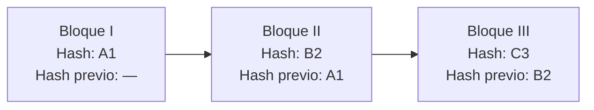

## UD1 · Apartado 6 — 🧩 Caso resuelto

> **[Módulo: Digitalización Aplicada a los Sectores Productivos]** · **Unidad 1 de 5**
> 🧭 Índice del módulo: [[00_Indice_DASP]]
>
> **📍 Cuándo se lee:** después del fundamento y antes de hacer el encargo. Es el modelo de cómo se resuelve un caso en este módulo.

---

> [!info] 📌 El caso: blockchain y medioambiente
> **Emma trabaja en FCC Medio Ambiente**, una empresa dedicada a la recogida y gestión de residuos no peligrosos. La empresa está transformando su actividad para hacerla más sostenible.
>
> A Emma le encargan estudiar si una tecnología concreta —el **blockchain**— puede ayudar a controlar mejor los residuos, y presentarlo en una reunión.
>
> *Caso adaptado de la práctica profesional resuelta del capítulo 1 del libro de referencia.*

> [!tip] Por qué te enseño este caso y no otro
> Porque enseña **el orden correcto**: Emma no empieza comprando tecnología. Empieza **entendiendo el problema**, luego estudia la tecnología, y solo entonces diseña la solución. Ese orden es el del módulo entero.

---

## Fase 1 · Entender antes de proponer

Emma **no** sabe de blockchain. Lo primero que hace no es pedir presupuesto: es **estudiar**.

- Ve una charla TEDx: *«Blockchain y NFT, ¿pueden ayudar a salvar el planeta?»*, de André Vanyi-Robin.
- Lee un artículo científico: *«Blockchain technology applications in waste management: overview, challenges and opportunities»*, del *Journal of Cleaner Production*.

> [!important] Fíjate en lo que ha hecho
> Ha buscado **una fuente divulgativa** para entender la idea y **una fuente científica** para no decir tonterías. Las dos. Eso es exactamente lo que se te va a pedir a ti en el encargo.

## Fase 2 · Explicarlo de forma que se entienda

Antes de proponer nada, Emma tiene que conseguir que en la reunión entiendan qué es un blockchain. Prepara un esquema:

*(Las etiquetas `A1`, `B2` y `C3` son inventadas para que se vea el encadenamiento; un hash real es una cadena larga de letras y números.)*

**La idea en una frase:** cada bloque guarda su propia huella y la del bloque anterior. Si alguien altera un bloque del pasado, su huella cambia y **todos los siguientes dejan de encajar**. Por eso lo escrito no se puede modificar sin que se note.

> [!warning] Y aquí Emma desmonta un prejuicio
> «El blockchain contamina muchísimo.» Es verdad **de algunos**, no de todos. La tecnología **proof of stake** consume muchísima menos energía que el **proof of work** clásico del bitcoin.
>
> Decir «blockchain contamina» sin distinguir el algoritmo es como decir «los coches contaminan» sin distinguir si es diésel o eléctrico.

## Fase 3 · El sistema que propone

Siete características, y ninguna es tecnológica porque sí:

| # | Qué propone | Para qué sirve |
|---:|---|---|
| 1 | Registrar cada residuo: tipo, cantidad, origen | Saber qué hay y de dónde viene |
| 2 | Que el registro sea **inmutable** | Que nadie manipule los datos después |
| 3 | Anotar cada traslado: qué, quién lo mueve, quién lo recibe | Trazabilidad completa |
| 4 | Consulta en tiempo real por cualquiera de la empresa | Transparencia interna |
| 5 | Registros válidos para verificación y certificación | Cumplir la normativa estatal y ambiental |
| 6 | Auditable por cualquier departamento o por un tercero | Poder demostrarlo ante una inspección |
| 7 | Combinable con **IA** e **IoT** | Automatizar el sistema más adelante |

## Fase 4 · Conectarlo con los ODS · `CE.01.f`

Emma cierra su propuesta relacionándola con la Agenda 2030. **Estos son los cuatro objetivos que cita, y la razón que da de cada uno:**

| ODS | Por qué encaja, según Emma |
|---|---|
| **ODS 12** · Producción y consumo responsables | Se promueve una gestión más responsable de los residuos |
| **ODS 14** · Vida submarina | Sin una gestión adecuada de los residuos, el medio marino se vería afectado |
| **ODS 15** · Vida de ecosistemas terrestres | Lo mismo en tierra: los residuos mal gestionados degradan el ecosistema |
| **ODS 6** · Agua limpia y saneamiento | Si los residuos están trazados y controlados, no acaban contaminando los recursos hídricos |

> [!tip] 💡 Fíjate en cómo los justifica, no en cuáles elige
> Emma no suelta una lista de ODS para quedar bien. **De cada uno da una razón concreta ligada a lo que hace su empresa.** Eso es lo que se te va a pedir a ti: no citar objetivos, sino explicar por qué tu propuesta los toca.

---

> [!success] 🎯 Lo que este caso te enseña a hacer
> 1. **Estudiar antes de proponer**, con dos tipos de fuente.
> 2. **Explicar la tecnología en una frase** que entienda quien no sabe del tema.
> 3. **Justificar cada característica** por lo que resuelve, nunca porque sí.
> 4. **Cerrar conectando con los ODS**, que es lo que pide `CE.01.f`.
>
> Ese es exactamente el guion de la práctica profesional del apartado 7. Vuelve aquí cuando la estés haciendo.

---

| ← Anterior | 🧭 Índice | Siguiente → |
| :--- | :---: | ---: |
| [[UD1.5_Glosario_y_Quizlet]] | [[00_Indice_DASP]] | [[UD1.7_Actividades]] |
