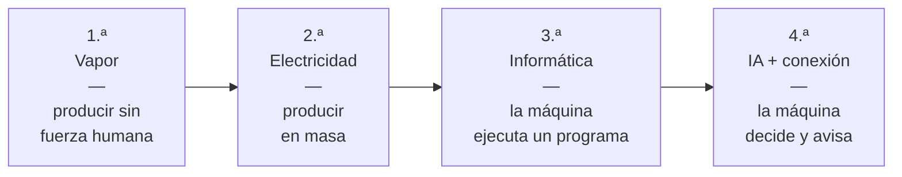
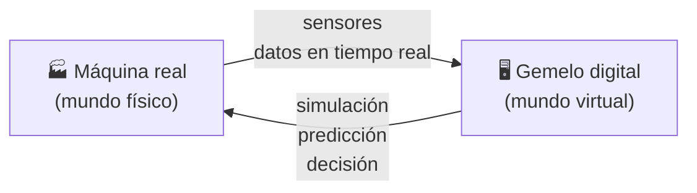

## UD2 · Apartado 3 — 📚 Fundamento

> **[Módulo: Digitalización Aplicada a los Sectores Productivos]** · **Unidad 2 de 5**
> 🧭 Índice del módulo: [[00_Indice_DASP]]
>
> **📍 Cuándo se lee:** es el contenido de la unidad. Lo vas a tener abierto casi las seis horas.

---

## 1 · EL PROBLEMA, ANTES QUE LA DEFINICIÓN

Una empresa empaqueta pescado congelado. El pescado llega del proveedor en bloques, y de vez en cuando viene con restos: un trozo de piel, una espina negra, un pedazo de la bolsa en la que vino.

**Hasta ahora eso lo miraba una persona**, pieza a pieza, ocho horas al día. Se le escapaban cosas —es humano—, y las que se le escapaban volvían como devoluciones. Cuando el cliente devolvía, nadie sabía decir de qué proveedor había venido aquel lote.

> [!warning] Una distinción clave para empezar
> Creer que la solución es **comprar una máquina**. No lo es.
>
> La solución empieza por poder contestar a esta pregunta: **¿cuántas piezas defectuosas llegan, de qué proveedor, y por qué motivo exactamente?** Si no sabes eso, no puedes negociar con el proveedor, ni saber si has mejorado, ni demostrar nada.
>
> La industria 4.0 no va de máquinas nuevas. Va de que **los procesos generen datos** y de que esos datos sirvan para decidir. La máquina es el instrumento; el dato es el producto.

Este caso es real y está resuelto entero en [[UD2.6_Caso_Resuelto]]. Vuelve aquí cuando lo hayas leído.

---

## 2 · LAS CUATRO REVOLUCIONES INDUSTRIALES · `CE.02.a`

Cada revolución industrial es lo mismo: **aparece una tecnología que cambia cómo se produce**, y detrás cambia la sociedad entera.

| # | Cuándo | La tecnología que la define | Qué cambió |
|---:|---|---|---|
| **1.ª** | Finales del s. XVIII | La **máquina de vapor** y el primer **telar mecánico** | Se puede producir sin depender de la fuerza humana o animal |
| **2.ª** | Finales del s. XIX | La **electricidad** | Producción en masa: los sectores industriales y las cadenas de montaje se aceleran de forma extraordinaria |
| **3.ª** | Segunda mitad del s. XX | La **informática** | Automatización de la producción: la máquina sigue un programa |
| **4.ª** | Hoy | La **inteligencia artificial (IA)** | La máquina no solo ejecuta: **decide**, y está conectada con todas las demás |

> [!info] La 4.ª no es solo IA
> La IA es la tecnología clave, pero no viaja sola. Le acompañan los **cobots** (robots colaborativos diseñados para trabajar junto a personas), el **IoT** *(Internet of Things, Internet de las cosas)*, la **realidad aumentada**, la **realidad virtual**, el **big data** y la **impresión 3D y 4D**.

### 2.1 · Quién le puso el nombre, y cuándo

> [!quote] La definición de Klaus Schwab
> El concepto de «cuarta revolución industrial» lo establece en **2016** **Klaus Schwab**, fundador y presidente ejecutivo del **Foro Económico Mundial**, que la define como la revolución que *«genera un mundo en el que los sistemas de fabricación virtuales y físicos cooperan entre sí de una manera flexible a nivel global»*.

> [!tip] 💡 Dos fechas que se confunden en el examen
> - **2011** — la primera vez que se habló de industria 4.0, en la feria tecnológica **Hannover Messe** (Alemania).
> - **2016** — el año en que **Schwab** publica *La cuarta revolución industrial* y acuña el término tal como se usa hoy.
>
> Si te preguntan **quién definió el concepto**, la respuesta es **Schwab**. Si te preguntan **dónde se habló por primera vez**, es **Hannover**. No son la misma pregunta.

**Y una matización que el propio libro hace:** las palabras de Schwab **se quedaron cortas**. El alcance real de esta revolución ha sido mucho más amplio, porque incluye también las energías renovables, la computación cuántica, la nanotecnología o la secuenciación genética.

---

## 3 · LOS SISTEMAS CIBERFÍSICOS · `CE.02.a` `CE.02.c`

> [!important] La definición
> Los **sistemas ciberfísicos** —**CPS**, *cyber-physical systems*— incorporan **chips y ordenadores interconectados con el exterior junto a componentes físicos**. Combinan **software, hardware y procesos físicos** para realizar funciones y tareas avanzadas.

Dicho en corto: **una cosa física que piensa y que habla con las demás.**

| Ejemplo de CPS | Parte física | Parte «ciber» |
|---|---|---|
| Un **dron** | Motores, hélices, cámara | Navegación, estabilización, envío de imagen |
| Un **vehículo autónomo** | Motor, frenos, dirección | Visión, decisión de frenar, mapa |
| **Instrumental médico asistido** en quirófano | Brazo, pinza, sensores | Precisión, límites de seguridad, registro |
| Una **fábrica inteligente** | Cintas, robots, sensores | Planificación, avisos, trazabilidad |

### 3.1 · De dónde vienen: los sistemas empotrados

> [!info] Esto no ha salido de la nada
> Los CPS son **la evolución de los sistemas empotrados**, que se usan en la industria **desde la década de los setenta**: sensores, actuadores y controladores.
>
> Un **sistema empotrado** es una máquina que lleva el microprocesador o microcontrolador dentro y hace las tareas para las que se programó. Lleva medio siglo existiendo.
>
> **Lo que añade el CPS es la conexión.** El sistema empotrado sabía; el ciberfísico, además, **cuenta lo que sabe** y lo cruza con lo que saben los demás.

> [!example] 📖 Vocabulario
> - **Sistema empotrado** — maquinaria o sistema donde el microprocesador o microcontrolador está dentro de ella y realiza una o varias de las tareas para las que ha sido programado.
> - **Sistema en tiempo real** — sistema donde **el tiempo de respuesta es decisivo**, más que la cantidad de procesamiento. El ejemplo del libro es el sistema de un avión: un retraso puede tener consecuencias negativas o catastróficas.
> - **Sistema crítico** — aquel en el que un fallo puede causar un daño económico irreparable o **daño humano**. Por eso hay que comprobarlos exhaustivamente antes de sacarlos al mercado. Ejemplos: un desfibrilador cardiaco o el control de una central nuclear.
> - **Actuador** — la pieza que **ejecuta** la orden en el mundo físico (abre una válvula, mueve un brazo). Es lo contrario del sensor, que solo mide.

### 3.2 · Qué tecnologías integra un CPS

Prácticamente todas las de esta unidad y de las dos siguientes:

| Tecnología | Para qué entra en el CPS |
|---|---|
| **Cloud computing** *(computación en la nube)* | Guardar y procesar los datos fuera de la máquina — es la **UD3** entera |
| **Realidad aumentada** | Enseñarle al operario información encima de lo que está mirando |
| **Robótica** | Mover cosas |
| **Simulación** | Probar un cambio sin pararlo todo |
| **IoT** | Que cada elemento tenga dirección propia y hable |
| **Big data** | Aprovechar cantidades de datos que no caben en una hoja de cálculo |
| **Fabricación aditiva** *(impresión 3D)* | Fabricar la pieza en el sitio en vez de pedirla |
| **Ciberseguridad** | Que todo lo anterior no sea una puerta abierta |
| **Integración de sistemas** | Que los programas de la empresa se entiendan entre ellos |

### 3.3 · Lo que de verdad cambia: los datos en tiempo real y los KPI

> [!important] La capacidad clave
> Un CPS **recopila datos del entorno físico en tiempo real**. Eso permite detectar si han cambiado los **KPI** —*key performance indicator*, **indicador clave de rendimiento**—, que son los números con los que se controla un proceso y se toman decisiones.
>
> **Sin esa monitorización en tiempo real, detectar el cambio sería lentísimo:** te enterarías al hacer el recuento de fin de mes, cuando ya has perdido el mes.

**Tres KPI típicos de producción**, que hay que saberse:

| Sigla | Qué significa | Qué mide | Se busca que sea |
|---|---|---|---|
| **OEE** | *Overall Equipment Effectiveness* | La **eficacia** de la maquinaria industrial | Alto |
| **MTBF** | *Mean Time Between Failures* | **Tiempo medio entre fallos**: cuánto aguanta el equipo funcionando entre una avería y la siguiente | **Mayor** ⇒ más productividad |
| **MTTR** | *Mean Time To Repair* | **Tiempo medio que se tarda en reparar** | **Menor** ⇒ más rendimiento |

> [!warning] ⚠️ MTBF y MTTR se parecen y van al revés
> **MTBF** es *cuánto aguanta funcionando entre una avería y la siguiente* — cuanto **más alto**, mejor.
> **MTTR** es *cuánto tardas en arreglarlo* — cuanto **más bajo**, mejor.
>
> Es la confusión más habitual de la unidad. Truco: **B** de *between* (entre fallos: la máquina funcionando), **R** de *repair* (reparar: la máquina parada).

> [!info] Otros KPI de una máquina pesada
> Tiempo de disponibilidad, índice de averías, productividad, eficiencia y consumo de combustible. Si el sistema detecta en tiempo real que uno de ellos cambia, **genera un aviso** y la decisión se toma antes, no después.

### 3.4 · Cómo tiene que ser un CPS para poder llamarse así

> [!abstract] Las cinco particularidades
> 1. **Interacción fuerte entre el mundo real y las redes de comunicaciones**, porque son sistemas en tiempo real.
> 2. **Verificación de que trabajan en tiempo real**, analizando el comportamiento **en el peor escenario posible**, no en el normal.
> 3. **Precisos y fiables**, mediante componentes inteligentes que les dan cierta autonomía y adaptación al cambio.
> 4. **Autónomos**, con hardware y software diseñados para ser inteligentes, exactos y sensibles a cualquier variación del sistema.
> 5. **Seguros, manteniendo la privacidad**.

> [!tip] Fíjate especialmente en el punto 2
> Un CPS **no se valida probándolo cuando todo va bien**. Se valida imaginando el peor día posible: la red saturada, dos sensores caídos, la máquina a plena carga. Si aguanta ahí, sirve.

---

## 4 · LOS SISTEMAS AUTOMATIZADOS: QUÉ HA CAMBIADO · `CE.02.b`

Automatizar no es nuevo —es la **tercera** revolución industrial—. Lo que ha cambiado es **cuánta libertad tiene la máquina**. Los seis tipos van de menos a más:

| # | Tipo | Cómo trabaja | Ejemplo |
|---:|---|---|---|
| 1 | **Fija o rígida** | Flujo **lineal y secuencial**, el clásico de las líneas tradicionales. Su ventaja es la fiabilidad y la reducción de errores y costes | Una embotelladora que siempre hace lo mismo |
| 2 | **Programable** | Usa **robótica industrial programada**: los robots pueden modificar su comportamiento adaptándose a condiciones cambiantes | Un brazo que cambia de programa según el modelo que toca |
| 3 | **Flexible** | Usa **IA y aprendizaje automático** *(machine learning)* para adaptarse a cualquier escenario | Los **cobots** |
| 4 | **Adaptativa** | Como la flexible, pero **los cambios los hace sin intervención humana** | Una línea que se reajusta sola |
| 5 | **De control de procesos** | Sensores e IoT **monitorizan y optimizan**; la intervención del operario es cada vez menor y la tasa de errores muy baja | Control de temperatura y presión en una planta química |
| 6 | **Robótica de procesos (RPA)** | *Robotic Process Automation*: **robots de software** que ejecutan tareas repetitivas | Un programa que revisa existencias y lanza el pedido solo |

> [!important] 📌 La RPA es la que te va a tocar a ti
> Los otros cinco tipos mueven cosas físicas. **La RPA no mueve nada: mueve datos.** Rellena formularios, copia de un programa a otro, comprueba stock, emite el pedido, actualiza el inventario en la web.
>
> Es decir: hace **exactamente las tareas administrativas repetitivas**. Por eso la práctica profesional de esta unidad va de RPA y no de brazos robóticos.
>
> El libro lo dice sin rodeos: con RPA *«los operarios se ven relegados de estas tareas repetitivas y realizan otras tareas de mayor valor para la empresa»*. Esa frase se puede leer de dos maneras, y las dos son ciertas. Hablaremos de ello en [[UD2.4_Lo_Que_No_Es]].

> [!info] Un ejemplo físico: robots de reciclaje
> En las plantas de tratamiento se utilizan robots para **clasificar, separar y triturar** residuos. Un *chatbot*, en cambio, es software de conversación: puede atender consultas, pero no procesa físicamente los materiales.

### 4.1 · Las tres características de la nueva industria

> [!abstract] Automatización · Virtualización · Descentralización
> | Característica | Qué significa |
> |---|---|
> | **Automatización** | Las cadenas de producción son cada vez más ágiles y **las máquinas son capaces de decidir** |
> | **Virtualización** | Los procesos son más eficientes gracias a sensores conectados a máquinas que usan **IA, gemelos digitales o modelos de simulación** |
> | **Descentralización** | Las máquinas toman **sus propias decisiones en tiempo real** y se acomodan a las necesidades del sistema de producción |

> [!danger] 🛑 Ojo: **flexibilidad NO es una de las tres**
> La flexibilidad pertenece a otra lista: es uno de los **tres factores de las empresas que triunfan** en la industria 4.0 —**agilidad, flexibilidad y eficiencia**—, no una de las tres características anteriores.
>
> **Tres características de la industria**: automatización, virtualización, descentralización.
> **Tres factores de las empresas que triunfan**: agilidad, flexibilidad, eficiencia.

### 4.2 · Qué necesita una empresa para entrar en la industria 4.0

No es una lista de compras de tecnología. Fíjate en cuántas de las seis hablan de **personas**:

1. Adoptar un **enfoque ágil** que permita a los equipos trabajar de manera colaborativa.
2. Potenciar la **formación continua** para impulsar mejoras e innovación.
3. **Trabajar de manera colaborativa**, para que todos aporten su *know how*.
4. Crear **programas de aprendizaje personalizados** para cada trabajador.
5. Desarrollar un **ecosistema tecnológico** junto a proveedores, vendedores y clientes.
6. **Invertir en soluciones IIoT** para limitar costes y construir una columna vertebral tecnológica estable y flexible.

> [!example] 📖 Vocabulario
> - **Know how** — el saber hacer: la habilidad que permite a una empresa o a un trabajador **diferenciarse del resto**. No es un título; es experiencia acumulada.
> - **IIoT** — *Industrial Internet of Things*, **Internet industrial de las cosas**: el IoT aplicado a máquinas y procesos industriales, no a bombillas y pulseras.
> - **Enfoque ágil** — forma de organizar el trabajo en ciclos cortos, revisando y corrigiendo sobre la marcha, en vez de planificarlo todo al principio.

---

## 5 · EL MUNDO FÍSICO Y EL MUNDO VIRTUAL · `CE.02.d`

> [!important] Qué es el mundo virtual
> Un **entorno simulado por ordenador** que tiene la virtud de ser **persistente**: siempre está ahí, aunque tú te desconectes, y sigue evolucionando.
>
> Los entornos virtuales persistentes se usan desde hace tiempo en videojuegos y también pueden servir para formación, simulación, colaboración o atención al cliente. Su ventaja es que **pueden adaptarse a distintos escenarios**, siempre dentro de los límites de la plataforma y del proyecto.

El libro analiza esta interrelación con **cinco conceptos**. Van de más abstracto a más concreto:

### 5.1 · El modelo VICE

> [!abstract] VICE: cómo van a abordar el mundo virtual los negocios
> Es un acrónimo en inglés — *Visualize, Inform, Communicate, Engage* — y describe las cuatro cosas que el mundo virtual permite hacer y el físico no:
>
> | Letra | En inglés | Qué permite |
> |:---:|---|---|
> | **V** | *Visualize* | **Visualizar** de forma virtual un entorno **que no podría crearse en el mundo real** |
> | **I** | *Inform* | **Formar e informar** en un entorno virtual, creando situaciones imposibles en la vida real, y permitir que los expertos compartan su conocimiento con gente geográficamente muy distante |
> | **C** | *Communicate* | **Colaborar e interactuar** con cualquier persona, en cualquier momento y desde cualquier lugar |
> | **E** | *Engage* | Acceder en el mundo virtual a **entretenimiento y contenidos** que serían imposibles en el real, económica o físicamente |
>
> Todo el modelo se apoya en dos ideas: **comunicación y colaboración**.

### 5.2 · La geolocalización

No ha cambiado solo los navegadores: ha cambiado **cómo el sistema se dirige a ti**.

| Dónde se usa | Para qué |
|---|---|
| **Recomendaciones personalizadas con IA** | Sugerirte un restaurante cercano, un evento, o la mejor ruta según el tráfico que te vas a encontrar |
| **Marketing y comercio electrónico** | Montar campañas según dónde está el público objetivo *(target)* |
| **Turismo y viajes** | Planear itinerarios, descubrir sitios |
| **Sistemas de emergencia** | Planificar rutas para atender una emergencia en el menor tiempo posible |
| **Cuerpos y fuerzas de seguridad** | Localizar personas de forma más eficiente |

### 5.3 · La realidad aumentada (RA)

> [!important] Definición
> La **realidad aumentada** —RA, *augmented reality* (AR)— es **la combinación del mundo real con el mundo virtual** usando una cámara y un dispositivo con pantalla: un móvil, una consola o un ordenador.
>
> **Cómo funciona:** el programa toma las imágenes reales, establece en ellas una serie de **marcadores** y sobre ellos construye y posiciona las imágenes virtuales. Además usa el **GPS**, el **acelerómetro** y el **giroscopio** del dispositivo para colocarlas donde toca.

| Ámbito | Qué aporta la RA |
|---|---|
| **Arquitectura** | Prever cómo van a ser el edificio y su entorno **antes de construir**, ahorrando tiempo y recursos |
| **Automoción** | Volkswagen la usa para visualizar y construir la estructura de sus vehículos: los ingenieros ven si el diseño encaja. Y en el **parabrisas**, mostrando consumo, navegación o datos del coche |
| **Medicina** | Generar imágenes 3D de los órganos **antes de operar**, para decidir mejor y minimizar el daño |
| **Gafas y lentes** | De las *Eye Tap* de los noventa a las Google Glass (2013) y al **Apple Vision Pro** |

> [!tip] 💡 El detalle del parabrisas
> Está comprobado que **es más seguro mostrar la información en el parabrisas que en la consola** del coche: así no se obliga al conductor a apartar la vista de la carretera. Ese es exactamente el argumento de la RA en el trabajo — la información va donde ya estás mirando.

### 5.4 · La hiperrealidad y el metaverso

> [!info] Hiperrealidad
> Un mundo donde **las simulaciones de la realidad parecen más reales que la propia realidad**. La idea es del sociólogo francés **Jean Baudrillard**, en su libro *Simulacra and simulation* (**1981**) — o sea, muy anterior a todo esto.
>
> Hoy ya es difícil distinguir si un *influencer* o un cantante es real o virtual. **Hatsune Miku**, la estrella japonesa del pop digital, llena estadios en todo el mundo.

> [!info] Metaverso
> **Mark Zuckerberg**, creador de Facebook, lo define como **el conjunto de espacios virtuales en los que crear y explorar con otros que no están en el mismo espacio físico**. Requiere realidad virtual y la tecnología que la hace posible.
>
> El primer movimiento serio fue que **Facebook se cambiara el nombre a Meta**. Y, como todo mundo virtual, **sigue funcionando aunque tú te vayas**.

### 5.5 · El gemelo digital

> [!important] 📌 Por qué el gemelo digital es importante aquí
> `CE.02.d` pide describir la interrelación entre el mundo físico y el virtual, y **el gemelo digital muestra esa relación de forma directa**: conecta continuamente un objeto real con su representación virtual.

> [!important] Qué es
> Un **gemelo digital** *(digital twin)* es una **copia virtual de algo real** —una máquina, una línea de producción, un edificio— que se mantiene **alimentada en tiempo real por los sensores del original**.
>
> No es un plano ni una maqueta: **cambia cuando cambia la cosa real**. Si la máquina se calienta, su gemelo se calienta.

**Para qué sirve, en tres usos:**

| Uso | Qué permite |
|---|---|
| **Simular** | Probar un cambio en el gemelo antes de tocar la máquina real, sin parar la producción |
| **Predecir** | Ver venir una avería mirando cómo se desvía el gemelo respecto a lo normal |
| **Formar** | Entrenar a alguien sobre el gemelo, donde equivocarse no cuesta dinero |

> [!tip] La relación es de ida y vuelta, y eso es lo importante
> El mundo físico **alimenta** al virtual con datos; el virtual **devuelve** decisiones al físico. Si solo hay ida —sensores que mandan datos que nadie usa— no hay gemelo digital: hay un archivo.

### 5.6 · Ventajas de conectar los dos mundos

| Dónde | Qué se consigue |
|---|---|
| **Industria** | Automatización y eficiencia: hoy se puede **predecir cuándo va a fallar una máquina**. Robots y personas trabajan coordinados, ahorrando tiempo y minimizando fallos (las fábricas de Tesla) |
| **Salud** | *Wearables* que monitorizan las constantes de los pacientes en tiempo real: el personal se centra en los casos más necesarios, se liberan tareas repetitivas y se reducen gastos |
| **Relación con el cliente** | Con geolocalización y RA, no solo recomendaciones personalizadas: también **más información del producto mediante una experiencia inmersiva** |
| **Educación** | Formarse con RA y RV en universidades a las que antes era impensable acceder, con una experiencia cuasifísica |
| **Smart cities** | Con cámaras, IoT y sensores: tráfico más operativo, entorno urbano más habitable, ciudad más eficiente energéticamente |

---

## 6 · POR QUÉ MIGRAR A 4.0 MEJORA LOS RESULTADOS · `CE.02.e`

Aquí no vale decir «porque es más moderno». `CE.02.e` te pide **relacionar la migración con la mejora de resultados**, y eso se hace con causas concretas.

### 6.1 · Los beneficios de digitalizar, uno a uno

| Beneficio | El mecanismo — **por qué** pasa |
|---|---|
| **Mejores decisiones en tiempo real** | En una **cadena de suministro digital**, clientes, productores y proveedores están interconectados: se decide con lo que está pasando, no con lo que pasó |
| **Más sostenibilidad** | Al controlar mejor el proceso productivo, la empresa es **más eficiente energéticamente** y **genera menos desperdicios** — con lo que enlaza directamente con la UD1 |
| **Más flexibilidad para el trabajador** | Al usar tecnología **cloud**, se puede teletrabajar o tener horarios más flexibles |
| **Más seguridad** | Adoptar capacidades digitales no solo conecta más los medios: hace **más segura** la unión entre el mundo digital y el físico |

### 6.2 · Las seis ventajas de los entornos 4.0

> [!success] Las que hay que saberse
> 1. **Mejor toma de decisiones**, al disponer de una cantidad ingente de datos en tiempo real: decisiones más informadas, **basadas en la evidencia**, más ágiles y acertadas.
> 2. **Menos errores**, al automatizar los procesos de negocio — y los que se producen se detectan a tiempo o se corrigen antes.
> 3. **Menos desperdicios**, al mejorar la calidad de los productos.
> 4. **Automatización avanzada**, que trae más eficiencia y precisión en la producción.
> 5. **Personalización en masa**: producir según las necesidades específicas de cada cliente, pero a escala.
> 6. **Cadena de suministro optimizada**, integrando IoT, IA y big data.

### 6.3 · Lo que cambia también para las personas

> [!info] Nuevas competencias, nuevos modelos de negocio
> Los entornos 4.0 obligan a que los trabajadores estén capacitados en habilidades nuevas: **ciberseguridad, programación de robots, análisis de datos, realidad virtual e inteligencia artificial**.
>
> Y hacen posible **más interconexión entre los eslabones de la cadena de valor** —proveedores, fabricantes, distribuidores, clientes—, lo que mejora la colaboración y la coordinación entre todos.
>
> De ahí están emergiendo **modelos de negocio nuevos**: basados en la ciberseguridad, en la prestación de servicios, en la **personalización en masa** o en la **economía de plataforma**.

> [!danger] 🛑 Y la contrapartida: la ciberseguridad
> **Cuanto más conectas, más superficie ofreces.** La interconexión de los sistemas industriales ha convertido la ciberseguridad en la preocupación principal de los entornos 4.0.
>
> El ejemplo del libro es **Estonia**, uno de los países más digitalizados de Europa: sus ciudadanos son conscientes de que un ciberataque puede interrumpir los servicios o provocar la pérdida o el robo de datos. **La ciberseguridad no es un extra del proyecto: es parte del proyecto.**

> [!example] 📖 Vocabulario · para los ejercicios del apartado 7
> - **IT** *(Information Technology)* — **tecnologías de la información**: los sistemas que manejan datos (ordenadores, servidores, programas de gestión).
> - **OT** *(Operational Technology)* — **tecnologías de operación**: los sistemas que manejan máquinas y procesos físicos (autómatas, sensores, control industrial).
> - **M2M** *(machine to machine)* — comunicación **directa entre máquinas**, sin que intervenga una persona.
> - **Trazabilidad** — poder reconstruir el recorrido completo de un producto: de dónde vino, por dónde pasó y a dónde fue.
> - **Fog computing** *(computación en la niebla)* — **modelo distribuido de procesamiento** que trata los datos **cerca de donde se generan**, en vez de enviarlo todo a la nube. En su versión industrial: *industrial fog computing architectures*.

---

## 7 · VENTAJAS PARA CLIENTES Y PARA EMPRESAS · `CE.02.f`

Este criterio pide **distinguir** las dos columnas. Es la tabla que vas a entregar en la actividad final, así que estúdiala sabiendo eso.

| | 🏢 Para la **empresa** | 🙋 Para el **cliente** |
|---|---|---|
| **Decisión** | Decide con datos en tiempo real, no con intuición | Recibe respuestas y plazos más fiables |
| **Calidad** | Menos errores y menos devoluciones | El producto llega bien a la primera |
| **Coste** | Menos desperdicio, menos energía, menos horas en tareas repetitivas | Precio más ajustado y más estable |
| **Producto** | Personalización en masa sin perder escala | Un producto **hecho a su medida** |
| **Tiempo** | Cadena de suministro optimizada | Entregas más rápidas |
| **Confianza** | Trazabilidad demostrable ante una inspección | Puede saber **de dónde viene** lo que compra |
| **Trato** | Conoce mejor a su cliente | Recomendaciones útiles y experiencias inmersivas del producto |
| **Personas** | Menos bajas por tareas repetitivas, gente en tareas de más valor | Le atiende alguien que no lleva ocho horas haciendo lo mismo |

> [!tip] 💡 Cómo se justifica bien este criterio
> **Cada ventaja del cliente tiene detrás un mecanismo de la empresa.** No digas «el cliente está más contento»: di **por qué**. *«El cliente recibe menos productos defectuosos porque la inspección la hace un sistema de visión artificial que no se cansa.»* Eso es una respuesta; lo otro es un eslogan.

---

> [!summary] 🎓 Lo que te llevas de aquí
> - Cada revolución industrial la define una tecnología: **vapor, electricidad, informática, IA**. La cuarta la nombró **Schwab en 2016**; se habló de ella por primera vez en **Hannover, 2011**.
> - Un **sistema ciberfísico** es la evolución del sistema empotrado de los setenta: lo nuevo **no es que piense, es que esté conectado**.
> - Lo que de verdad cambia es que hay **datos en tiempo real** y **KPI** para leerlos: OEE, MTBF (más alto mejor), MTTR (más bajo mejor).
> - Hay **seis tipos de automatización**, y la que toca a la administración es la **RPA**, que automatiza tareas de datos, no de máquinas.
> - Las tres características de la industria 4.0 son **automatización, virtualización y descentralización** — *flexibilidad no*.
> - El mundo físico y el virtual se conectan en las dos direcciones: el **gemelo digital** es el ejemplo más claro.
> - Migrar a 4.0 mejora los resultados por **mecanismos concretos**, y trae un problema propio: **la ciberseguridad**.
>
> **Siguiente:** [[UD2.4_Lo_Que_No_Es]]

---

| ← Anterior | 🧭 Índice | Siguiente → |
| :--- | :---: | ---: |
| [[UD2.2_Donde_Estamos]] | [[00_Indice_DASP]] | [[UD2.4_Lo_Que_No_Es]] |
