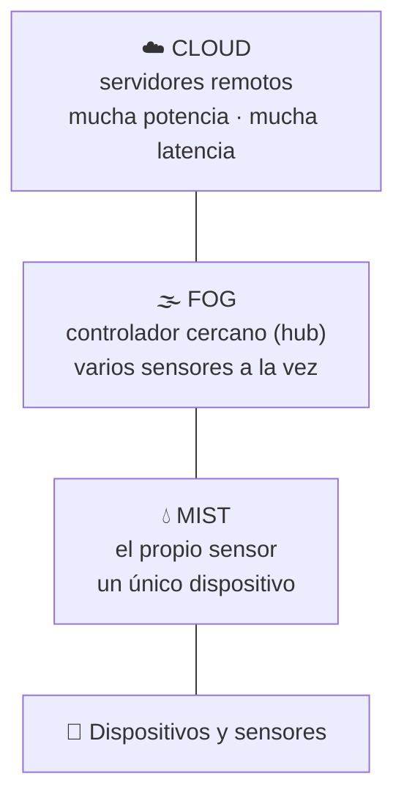

## UD3 · Apartado 3 — 📚 Fundamento

> **[Módulo: Digitalización Aplicada a los Sectores Productivos]** · **Unidad 3 de 5**
> 🧭 Índice del módulo: [[00_Indice_DASP]]
>
> **📍 Cuándo se lee:** es el contenido de la unidad. Lo vas a tener abierto casi las seis horas.

---

## 1 · EL PROBLEMA, ANTES QUE LA DEFINICIÓN

Una empresa de importación gestiona cada pedido **por teléfono, por WhatsApp y por correo**. El presupuesto está en el correo de uno, la confirmación en el WhatsApp de otro y la factura en una carpeta del ordenador de un tercero.

Su dueño lo describe así: *«hay un enjambre de archivos e información que es inmanejable»*.

> [!warning] Una distinción clave para empezar
> Creer que la nube es **un sitio donde se guardan cosas**. Eso es un disco duro con Internet.
>
> La nube es **un modelo de contratación**: en lugar de comprar máquinas, programas y licencias, y de pagar a alguien para que los mantenga, **alquilas el servicio y pagas por lo que usas**. Lo que cambia no es dónde están los ficheros: es **quién se encarga de qué** y **cómo se paga**.
>
> Por eso la pregunta de esta unidad nunca es «¿dónde lo guardo?». Es **«¿hasta dónde me quiero encargar yo?»**.

Ese caso es la práctica profesional del apartado 7. La dueña se llama **Marta**.

---

## 2 · CLOUD Y CLOUD COMPUTING NO SON LO MISMO · `CE.03.b`

Se usan como sinónimos y no lo son. **Esto cae en el examen.**

| Término | Qué es |
|---|---|
| **Cloud** (nube) | **La red enorme de servidores remotos** repartidos por todo el mundo, conectados entre sí a través de Internet para funcionar como **un único ecosistema**. Es lo que permite el correo electrónico o el *streaming* de vídeo |
| **Cloud computing** (informática o computación en la nube) | **Los servicios y productos que funcionan sobre esa red**, por lo general bajo demanda y de pago: acceso a recursos informáticos compartidos y configurables a través de Internet — servidores, almacenamiento, bases de datos, redes o software |

**Dicho corto:** el *cloud* es la infraestructura; el *cloud computing* es lo que contratas encima.

### 2.1 · Para qué sirve la nube: sus funciones · `CE.03.b`

> [!abstract] Las tres funciones que nombra el criterio
> | Función | Qué significa en la práctica |
> |---|---|
> | **Procesamiento de datos** | Los cálculos los hace un servidor remoto, no tu ordenador. Tu portátil viejo puede usar una herramienta que él nunca podría ejecutar |
> | **Intercambio de información** | Varias personas —o varias empresas, o varios países— trabajan **sobre los mismos datos** sin mandárselos por correo |
> | **Ejecución de aplicaciones** | El programa **vive en el proveedor**; tú entras por una página web y lo usas |
>
> Y una cuarta que el criterio deja implícita en su *«entre otros»*: **el almacenamiento**, que es la que todo el mundo cree que es la única.

> [!info] Cómo funciona, en dos frases
> 1. La plataforma de servicios en la nube **posee los recursos** y se hace responsable del **mantenimiento del hardware**.
> 2. El cliente que contrata el servicio **lo configura** y administra sus aplicaciones **mediante una interfaz web**.

> [!quote] ¿Sabías que…?
> El término *cloud computing* aparece en **1996** en un plan de negocio elaborado por **George Favaloro**, directivo de Compaq Computer, y **Sean O'Sullivan**, fundador de NetCentric. No es una moda reciente.

---

## 3 · LOS NIVELES DE LA NUBE · `CE.03.a`

El criterio `CE.03.a` habla de «los diferentes niveles». En el libro, «niveles» son **dos cosas distintas**, y hay que saber separarlas:

| | Qué responde |
|---|---|
| **Tipos de servicio** — IaaS · CaaS · PaaS · SaaS | **¿Hasta dónde llega el proveedor y dónde empiezo yo?** |
| **Modelos de despliegue** — pública · privada · híbrida · comunitaria | **¿De quién es la infraestructura y con quién la comparto?** |

### 3.1 · Los tipos de servicio: la escalera

La diferencia entre ellos es **el grado de descentralización de la gestión informática**. Cuanto más subes, menos administras tú.

| Capa | on-premise | IaaS | CaaS | PaaS | SaaS |
|---|:---:|:---:|:---:|:---:|:---:|
| Datos y configuración | 🧑 | 🧑 | 🧑 | 🧑 | 🧑 |
| Aplicación | 🧑 | 🧑 | 🧑 | 🧑 | ☁️ |
| *Runtime* (entorno de ejecución) | 🧑 | 🧑 | ☁️ | ☁️ | ☁️ |
| Sistema operativo | 🧑 | 🧑 | ☁️ | ☁️ | ☁️ |
| Virtualización | 🧑 | ☁️ | ☁️ | ☁️ | ☁️ |
| Hardware | 🧑 | ☁️ | ☁️ | ☁️ | ☁️ |
>
🧑 lo gestionas **tú (el cliente)** · ☁️ lo gestiona **el proveedor cloud**

> [!important] Lee la tabla de abajo arriba y verás la idea
> **La frontera sube.** En `on-premise` te encargas de todo; en `SaaS` solo te encargas de **tus datos**. Ninguna fila cambia de dueño hacia atrás: **es una escalera, no un menú suelto**.
>
> Y fíjate en la fila de arriba: la organización cliente sigue decidiendo **qué datos usa, para qué y quién accede**. El proveedor asume las tareas técnicas contratadas, pero eso no elimina las obligaciones del cliente sobre el uso legítimo y el control de acceso.

> [!info] La escalabilidad no es una capa
> Es una propiedad del servicio: en IaaS el cliente decide y configura cómo ampliar recursos; desde PaaS el proveedor puede automatizar buena parte de ese crecimiento. Por eso se explica aparte de hardware, sistema operativo y aplicaciones.

**Los cuatro, uno a uno:**

> [!example] 🅰️ IaaS · *Infrastructure as a Service* — infraestructura como servicio
> El que da **mayor flexibilidad**: acceso a las características de la red, a los equipos —virtuales o dedicados— y a las bases de datos. **El cliente crea y administra los sistemas operativos y sus recursos.**
>
> Es el tipo **más parecido a la administración clásica** de un departamento de informática: lo mismo de siempre, pero sin comprar máquinas.

> [!example] 🅱️ PaaS · *Platform as a Service* — plataforma como servicio
> Desaparece la administración del **sistema operativo y del hardware**. Solo hay que **instalar las aplicaciones y administrarlas**: ni parches del sistema, ni copias de seguridad, ni tareas de mantenimiento.
>
> Ejemplo del libro: **Google Cloud Run**.

> [!example] 🅲 SaaS · *Software as a Service* — software como servicio
> El proveedor **instala y mantiene las aplicaciones** y el usuario simplemente **las usa**.
>
> Ejemplos: contratar el **correo web** de la empresa o un **sistema de contabilidad online**. Es una modalidad muy extendida porque permite usar aplicaciones sin instalarlas ni mantener su infraestructura.

> [!example] 🅳 CaaS · *Containers as a Service* — contenedores como servicio
> Se desarrollan y despliegan las aplicaciones **mediante contenedores**. El entorno lo gestiona el proveedor, y quien programa **no se preocupa ni de la infraestructura ni de la plataforma**.

> [!tip] 💡 La regla para no confundirlos en el examen
> Pregúntate **qué es lo primero que dejas de tocar**:
> - ¿Sigues administrando el sistema operativo? → **IaaS**
> - ¿Ya no lo administras, pero instalas tú la aplicación? → **PaaS**
> - ¿Ni siquiera la instalas, solo la usas? → **SaaS**
> - ¿Despliegas tu aplicación en contenedores que gestiona otro? → **CaaS**
>
> **Regla de clasificación:** «acceso a la red, a los equipos y a las bases de datos» describe **IaaS**, no PaaS.

### 3.2 · Los modelos de despliegue

| Modelo | Qué es | Cuándo se elige |
|---|---|---|
| **Nube pública** | **Todas** las aplicaciones están en la nube. O se crean allí desde cero, o se transfieren desde la infraestructura que ya existía | Lo habitual: máxima economía de escala |
| **Nube híbrida** | **Parte** de las aplicaciones están en la nube y parte residen fuera, pero **la conexión entre ambas debe ser posible**. Suele irse balanceando a conveniencia del cliente | Cuando hay algo que, por lo que sea, no puede salir de casa |
| **Nube privada** | Recursos cloud **de uso exclusivo de una organización**. Puede estar en sus propias instalaciones o alojada por un proveedor. Si el hardware está en las instalaciones de la organización se habla de **on-premise**, pero *privada* y *on-premise* no significan lo mismo | Cuando se necesita control exclusivo por confidencialidad, cumplimiento o integración |
| **Nube comunitaria** | La más reciente: **varias empresas comparten recursos y servicios** porque se dedican al mismo sector o a actividades parecidas | Cuando el servicio es demasiado caro para una empresa pequeña sola |

> [!info] Dos matices de la nube comunitaria que suelen sorprender
> 1. **A veces es algo más cara que la pública**, pero se puede afrontar porque el gasto se reparte entre varias empresas.
> 2. **Suele ser más segura que la pública**, porque cada empresa vela por la confidencialidad de sus datos.

---

## 4 · VENTAJAS DE LA NUBE · `CE.03.e`

### 4.1 · Las seis ventajas del cloud computing

> [!success] Las que hay que saberse
> 1. **Precios competitivos.** Las empresas se benefician de la **economía a gran escala**: como muchas comparten los recursos, el proveedor puede bajar precios. **Cuantos más usuarios, más barato**.
> 2. **Consumo responsable.** No se invierte en servidores o centros de datos sin saber qué uso tendrán: **solo se paga por lo que se consume** y por lo que se reserva.
> 3. **Reducción de costes.** No hay que comprar hardware: con un clic se adquieren más recursos, y el tiempo de desarrollo baja drásticamente. **Experimentar sale barato**, porque no hay que aprovisionar ni configurar máquinas.
> 4. **Disminución del gasto.** Menos **consumo eléctrico**, y no hacen falta grandes centros de datos ni oficinas sobredimensionadas.
> 5. **Trabajo flexible.** Se fomenta el **teletrabajo** y la informática móvil: con las aplicaciones en la nube se trabaja desde cualquier sitio.
> 6. **Accesibilidad de los recursos.** Beneficia a las empresas con **ubicaciones descentralizadas**: cuando hay varias sedes, llegar a la nube suele salir **mejor que llegar al servidor de la sede central**, y el acceso es más sencillo desde cualquier sitio.

### 4.2 · On-premise contra cloud, punto por punto

Esta tabla es del libro (cuadro 3.4) y es **la que más preguntas del test genera**:

| | **On-premise** (en tus instalaciones) | **Cloud** |
|---|---|---|
| **Coste** | Se pagan **licencias**, y hay que actualizarlas | Se paga **el servicio**. Sin gastos de licencias ni de actualizaciones |
| **Mantenimiento** | Lo haces tú: software, sistema operativo, parches, copias | Lo hace el proveedor; suele ir **incluido en el precio** |
| **Adaptación** | Más complejo de adaptar; a veces exige programación extra | Los productos están pensados para adaptarse fácilmente |
| **Energía** | Gasto **alto** (servidores, *rack*, NAS) | Gasto **mucho menor** |
| **Personal** | Gasto **mucho mayor** | Gasto **menor** |
| **Formación** | No suele estar tan disponible | Formación online a disposición del usuario |
| **Latencia** | **Mucho menor**, al estar los archivos en local | **Mayor**, según el volumen de datos que se descarguen |
| **Fiabilidad** | La caída del servidor puede tener efectos significativos sobre el negocio | Se usan **servicios redundantes**: la fiabilidad es mayor |
| **Escalabilidad** | **Menos escalable**: hay que prever el crecimiento y comprar por adelantado | **Totalmente escalable** |

> [!important] La latencia es una diferencia importante, pero no la única
> Es la respuesta a una pregunta literal del test del libro: *«¿en qué característica supera la solución on-premise al cloud computing?»* → **en la latencia**.
>
> Y no es una curiosidad: **es justo el motivo por el que existen el edge, el fog y el mist**, que es lo que viene ahora.

### 4.3 · Por qué la nube es rentable para la empresa

Seis razones, y las dos primeras van contra lo que casi todo el mundo cree:

| Razón | Lo que dice el libro |
|---|---|
| **Seguridad** | Al contrario de lo que se pueda pensar, es **más seguro que los sistemas clásicos**, porque hay equipos de personas dedicados íntegramente a la seguridad |
| **Coste** | Puede reducir el desembolso inicial y ajustar recursos al uso, pero el coste total depende del consumo, la transferencia de datos, las licencias y la administración |
| **Más control** | Es escalable y adaptable, y hay profesionales monitorizando el sistema de forma más exhaustiva que un técnico en las propias instalaciones |
| **Escalabilidad** | Se elige el modelo —pública, híbrida, privada o comunitaria— según lo que se necesite |
| **Fiabilidad** | Facilita copias e infraestructura redundante, pero introduce dependencias del proveedor, la configuración y la conectividad |
| **Productividad** | Mayor, porque las tareas repetitivas se automatizan **con IA y aprendizaje automático** y la gente se dedica a lo estratégico |

> [!quote] La frase del capítulo que más lejos llega
> *«Muchas veces se suele pensar que la informática es un gasto que se debe reducir para maximizar el beneficio. Sin embargo, la informática es la herramienta que le va a permitir a la organización lograr sus objetivos. Por lo tanto, deja de ser un gasto para convertirse en una buena inversión.»*
>
> Guárdala: es exactamente el argumento que tendrás que sostener en el informe de la **UD5**.

---

## 5 · EL EDGE COMPUTING · `CE.03.c`

> [!important] Definición
> El **edge computing** —**computación periférica**— consiste en **acercar el poder de procesamiento lo más posible a donde se generan los datos**. Es decir: **acercar la nube hasta el usuario, hasta el borde mismo (*edge*) de la red**.

**Por qué existe:** porque hay cosas que **no pueden esperar** a que los datos viajen hasta un servidor lejano y vuelvan.

| Ejemplo | Por qué no vale la nube |
|---|---|
| **Vehículos autónomos** | Deciden **en milisegundos**: necesitan procesar en tiempo real y con **latencia muy baja**. Además, cámaras y sensores generan grandes cantidades de datos que no conviene enviar íntegramente por Internet |
| **Termostatos inteligentes** | Ayudan a la eficiencia energética del hogar. Y ojo: al recopilar datos de las casas **afectan a la privacidad** — se puede saber cuándo no estás |
| **Semáforos** | Responden en tiempo real para mejorar la fluidez y la seguridad: adaptan su funcionamiento al volumen de tráfico y peatones, o informan de incidencias a la policía |

### 5.1 · Cloud contra edge, punto por punto

| | **Cloud computing** | **Edge computing** |
|---|---|---|
| **Localización** | Servidores **alejados** de los dispositivos | Infraestructura **cercana** a los dispositivos |
| **Dónde se procesa** | En la nube, lejos de donde se generan los datos | Cerca de donde se generan, **habitualmente en tiempo real** |
| **Tipo de aplicaciones** | Las que **no dependen del tiempo** | Las de **tiempo real** |
| **Potencia de proceso** | **Mucha** | **Poca** |
| **Almacenamiento** | **Mucha** capacidad | **Poca** capacidad |
| **Análisis** | En profundidad | En tiempo real |
| **Conectividad** | **Necesaria** | **No necesaria** |
| **Costes** | Altos en conectividad y ancho de banda | Bajos en conectividad y ancho de banda |
| **Latencia** | Relativamente **alta** | **Baja** |

> [!warning] ⚠️ Diferencia esencial: potencia y latencia
> **El edge NO tiene más potencia que la nube: tiene menos.** Lo que tiene es **menos latencia**.
>
> Son dos cosas distintas: *potencia* es cuánto puede calcular; *latencia* es cuánto tarda en contestar. El edge gana en rapidez de respuesta **precisamente porque renuncia a la potencia** de un centro de datos.

> [!example] 📖 *Edge AI*
> Es la **combinación de edge computing e inteligencia artificial**: los algoritmos se ejecutan **localmente en el dispositivo**, con datos locales.
>
> No es futuro, ya lo usas: el **reconocimiento facial del móvil** en milisegundos · el coche que **avisa o frena** si detecta una salida de carril · la **cámara que reconoce a un intruso** y avisa a la central · la planta química donde **el sistema se desconecta solo** si un sensor detecta un escape.
>
> Lo que aporta a la empresa: **latencia mínima**, decisiones tomadas por el propio dispositivo, y **más seguridad y privacidad porque todo se procesa localmente**.

---

## 6 · FOG Y MIST · `CE.03.d`

> [!important] La idea, en una frase
> **Cloud, fog y mist marcan la distancia a la que se procesan los datos.** No son tecnologías rivales: son **capas**.

> **Edge computing es el concepto general**: procesar cerca del lugar donde nacen los datos. **Fog** lo hace en un nodo o controlador próximo y **mist** en el propio sensor o dispositivo. Por eso *edge* no es un cuarto peldaño paralelo a fog y mist, sino la zona cercana que ambos concretan.

> [!tip] 🌫️ La metáfora es literal y por eso funciona
> - El **rocío** (*mist*) está **en la flor**.
> - La **niebla** (*fog*) está **sobre las flores**.
> - La **nube** (*cloud*) está **por encima de todo**.

| Capa | A qué distancia procesa | Ejemplo del libro |
|---|---|---|
| ☁️ **Cloud** | **Muy lejos** del usuario | El servicio de Gmail |
| 🌫️ **Fog** | **Mucho más cerca** que la nube | Una fábrica inteligente |
| 💧 **Mist** | **Todavía más cerca**: en el propio dispositivo | Un *smartphone* |

### 6.1 · Por qué existen

Porque **no todo funciona bien en la nube**. Dos ejemplos del libro:

- Es **inviable** que las cámaras de seguridad de un edificio vuelquen sus datos a la nube en tiempo real: **saturarían la red** e impedirían que el resto de dispositivos funcionase.
- Los vehículos autónomos generan **terabytes** y necesitan **baja latencia**: no es compatible con procesar en la nube.

### 6.2 · Cuándo cada uno, y qué falla en cada uno

| | **Fog computing** | **Mist computing** |
|---|---|---|
| **Cuándo se usa** | Sistemas con **múltiples sensores** que necesitan latencia muy baja —por ejemplo, la centralita de un coche autónomo que combina sus lecturas— | Cuando un sensor puede procesar por sí mismo —por ejemplo, una cámara que detecta movimiento localmente— |
| **Dónde procesa** | En un **hub** o controlador central cercano | **En el propio sensor** |
| **Su punto débil** | **El hub**: si se satura o falla, **cae todo el sistema** | Necesita **batería más potente** y un **sensor más inteligente** para almacenar y procesar |
| **Su ventaja extra** | — | **Consume menos ancho de banda** y transmite menos información: procesa y responde el propio sensor |

> [!danger] 🛑 Las tres frases que hay que tener claras
> 1. **Cuando se necesita gran capacidad de procesamiento, la mejor solución es el cloud computing.** Fog y mist no compiten en potencia.
> 2. **Fog y mist son más seguros que el cloud**, porque los datos se procesan localmente sin enviarse a un servidor remoto; y si hay que enviarlos, tienen capacidad para **cifrarlos** antes.
> 3. **Mist está más cerca que fog.** Si hay que identificar cuál procesa en el propio sensor, es **mist**.

---

## 7 · CÓMO SE MIGRA A LA NUBE

Siete pasos, en este orden:

| # | Paso | Qué se gana |
|---:|---|---|
| 1 | **Migrar los servicios a la nube** con un plan | Dejar de actualizar los sistemas antiguos on-premise, y contar con el equipo del proveedor |
| 2 | **Automatizar** todo lo posible: copias, procesos, informes | Menos errores, más eficiencia y **personal libre para tareas importantes** |
| 3 | **Subcontratar las funciones no esenciales** | Empresas especializadas lo hacen **más barato y mejor** |
| 4 | **Usar software libre** | Sin pago de licencias; también tiene soporte, aunque a veces haya que contratarlo aparte |
| 5 | **Contar con un consultor especializado** | Optimizar sistemas, recortar gastos superfluos, gestionar mejor los recursos |
| 6 | **Virtualizar**, que es lo que hacen los proveedores; muchos usan **contenedores (Docker)** y un **orquestador que los coordina (Kubernetes)** | Aprovechar mejor cada máquina |
| 7 | **Monitorizar** | Detectar a tiempo los problemas que van a disparar el gasto |

> [!tip] 💡 Fíjate en el paso 2, que es de la unidad anterior
> Automatizar lo repetitivo —copias, informes, procesos— **es RPA**. La UD2 y la UD3 se dan la mano justo aquí: primero decides dónde vive el sistema, después automatizas lo que hace.

---

## 8 · LAS PROFESIONES QUE HA CREADO LA NUBE

Esto te interesa por un motivo muy práctico: **son ofertas de empleo reales**.

| Perfil | Qué hace |
|---|---|
| **Ingeniero cloud** | Diseña, desarrolla y gestiona aplicaciones y sistemas en entorno cloud. Debe conocer **AWS, Microsoft Azure, Oracle Cloud o Google Cloud Platform**. Muchos son antiguos ingenieros de sistemas reconvertidos |
| **Arquitecto cloud** | Bases de datos específicas en cloud (**MongoDB**) y experiencia en diseño, implantación y transformación de servicios |
| **Arquitecto de datos cloud** | Cómo se procesan y se distribuyen los datos entre aplicaciones; informes y analíticas |
| **Programador cloud** | Desarrolla aplicaciones que funcionen en distintas plataformas cloud |
| **Gestor en analítica avanzada de datos** | Analíticas sobre los datos de las aplicaciones cloud para encontrar **patrones y tendencias**, con IA y aprendizaje automático |
| **Moderador de chats** | Crear relación duradera con los clientes, estimular conversaciones, animar comunidades. **Requiere habilidades comunicativas**, no técnicas |

> [!info] Y para el trabajador, no solo para la empresa
> La nube permite trabajar **de forma más flexible, autónoma y desde cualquier lugar**: se ahorran gastos de transporte, comida, ropa y, sobre todo, **tiempo**. Y meterse en estas tecnologías evita **quedarse obsoleto**.

---

> [!summary] 🎓 Lo que te llevas de aquí
> - **Cloud** es la red de servidores; **cloud computing** son los servicios que contratas encima. No son sinónimos.
> - Los **tipos de servicio** son una escalera: `on-premise → IaaS → CaaS → PaaS → SaaS`. Cuanto más subes, menos capas técnicas administras; la responsabilidad se reparte según el servicio y el contrato.
> - Los **modelos de despliegue** son otra cosa: pública, privada, híbrida y comunitaria. Una nube privada puede estar *on-premise* o alojada por un proveedor.
> - La nube gana en coste, mantenimiento, energía, personal, fiabilidad y escalabilidad. **On-premise solo gana en latencia.**
> - Y de esa única casilla nacen **edge, fog y mist**: no dan más potencia, dan **menos espera**.
> - **Mist está más cerca que fog, y fog más cerca que cloud.** El rocío, la niebla y la nube.
>
> **Siguiente:** [[UD3.4_Lo_Que_No_Es]]

---

| ← Anterior | 🧭 Índice | Siguiente → |
| :--- | :---: | ---: |
| [[UD3.2_Donde_Estamos]] | [[00_Indice_DASP]] | [[UD3.4_Lo_Que_No_Es]] |
