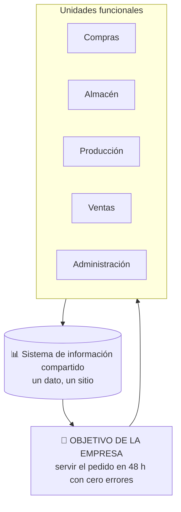

## UD4 · Apartado 3 — 📚 Fundamento

> **[Módulo: Digitalización Aplicada a los Sectores Productivos]** · **Unidad 4 de 5**
> 🧭 Índice del módulo: [[00_Indice_DASP]]
>
> **📍 Cuándo se lee:** es el contenido de la unidad. Lo vas a tener abierto casi las ocho horas.

---

## 1 · EL PROBLEMA, ANTES QUE LA DEFINICIÓN

Una cadena de muebles imprimía cada año **el catálogo en papel más repartido del mundo**. Decenas de millones de ejemplares, en decenas de idiomas. Era su seña de identidad desde 1951.

**Dejó de imprimirlo.** No porque el papel esté mal visto: porque una aplicación con **realidad aumentada** hace algo que el catálogo no podía hacer — enseñarte **ese sofá, en tu salón, a escala**, antes de comprarlo.

> [!warning] Una distinción clave para empezar
> Estudiar las tecnologías **como una lista de nombres**. Diez definiciones aprendidas no sirven para nada: en el examen y en el trabajo se pregunta **cuál usarías y por qué**.
>
> Cada tecnología de este capítulo es la respuesta a **una pregunta concreta de negocio**:
> - *«¿Cómo enseño el producto en casa del cliente antes de que lo compre?»* → realidad aumentada.
> - *«¿Cómo sé que esta vacuna no ha roto la cadena de frío?»* → blockchain e IoT.
> - *«¿Cómo pruebo un cambio en la línea sin parar la fábrica?»* → gemelo digital.
>
> **Estudia las preguntas y las respuestas se quedan solas.**

---

## 2 · QUÉ SON LAS TDH · `CE.04.a`

> [!important] Definición
> Las **tecnologías digitales habilitadoras (TDH)** se llaman así porque **proporcionan la base para desarrollar otras tecnologías** y son **la punta de lanza de la innovación** en campos como las telecomunicaciones, la informática, la electrónica, la biotecnología o la nanotecnología.

**«Habilitadora» significa exactamente eso: que habilita.** No es un producto final, es lo que hace posible el producto final de otro. El 5G no se vende a nadie por sí mismo, pero sin 5G no hay flota de drones coordinados.

Las **trece** que se trabajan en la unidad:

| # | Tecnología | La pregunta que responde |
|---:|---|---|
| 1 | **Tecnología 5G** | ¿Cómo conecto muchísimas cosas, muy rápido y sin retraso? |
| 2 | **Blockchain** | ¿Cómo me fío de un registro que no controla nadie en concreto? |
| 3 | **Big data** | ¿Cómo saco algo en claro de un océano de datos? |
| 4 | **Inteligencia artificial (IA)** | ¿Cómo hago que el sistema decida o prediga? |
| 5 | **Cobots** | ¿Cómo pongo un robot **al lado** de una persona sin peligro? |
| 6 | **Gemelos digitales** | ¿Cómo pruebo sin romper lo real? |
| 7 | **Impresión 4D** | ¿Cómo hago un objeto que cambie solo? |
| 8 | **DLT** | ¿Cómo comparto un registro entre varios sin autoridad central? |
| 9 | **Ciberseguridad IT y OT** | ¿Cómo protejo todo lo anterior? |
| 10 | **Fuzzy logic** *(lógica difusa)* | ¿Cómo decido cuando la realidad no es «sí o no»? |
| 11 | **IoT** *(Internet de las cosas)* | ¿Cómo hago que un objeto cualquiera informe de lo que le pasa? |
| 12 | **Fabricación aditiva** *(impresión 3D)* | ¿Cómo fabrico la pieza aquí en vez de esperarla? |
| 13 | **Realidad virtual (RV)** | ¿Cómo meto a alguien en un sitio donde no está? |

> [!info] Por qué trece y no diez
> Las tres últimas están **nombradas una a una en el criterio `CE.04.b`**, así que tienen ficha propia como las demás. El IoT y la realidad virtual ya te sonarán de la UD2: aquí se miran **como tecnología del catálogo**, con sus aplicaciones y su caso.

---

## 3 · LAS TRECE TECNOLOGÍAS, UNA A UNA · `CE.04.b`

### 3.1 · Tecnología 5G

> [!info] Qué es y qué aporta
> La **quinta generación** de redes móviles: **menos latencia, más velocidad y más potencia**, con capacidad para una conectividad ultrarrápida. De su mano crecen el **big data**, el **IoT**, la **IA** y el **cloud computing**.
>
> **Frecuencias:** en España la 5G utiliza bandas como **700 MHz, 3,5 GHz y 26 GHz**. Las dos primeras aportan cobertura y capacidad; la banda milimétrica de 26 GHz permite mucha capacidad en zonas concretas, pero tiene menor alcance. El despliegue también puede apoyarse en infraestructura LTE *(long term evolution)* durante la transición desde 4G.
>
> **Qué hace posible:** desplegar una flota de **vehículos autónomos**, coordinar **drones sincronizados**, realizar **intervenciones quirúrgicas a distancia**.

### 3.2 · Blockchain

> [!info] Qué es
> **Un registro distribuido que agrupa operaciones en bloques enlazados.** Varias máquinas de una red mantienen y validan copias del registro según un protocolo común; no tienen por qué estar repartidas por todo el mundo.
>
> **Qué consigue:** reduce los costes de las transacciones y **elimina los dilemas de confianza**.

> [!example] El ejemplo que lo explica todo
> Los datos de los **propietarios de inmuebles** de un país, en una base distribuida con **múltiples copias independientes**. Cualquiera puede consultarlos, y **de nada sirve falsear una copia**: las demás dirían lo contrario.

> [!tip] 💡 *Smart contracts* — contratos inteligentes
> Un **programa que se ejecuta cuando se cumplen los acuerdos pactados** — por ejemplo, liberar un pago. Permite que **dos desconocidos hagan negocios sin intermediarios** de forma fiable.
>
> **Se usa para:** registrar la propiedad de inmuebles · automatizar indemnizaciones de seguros · gestionar activos bursátiles · hacer funcionar cadenas de suministro.
> **Plataformas:** Ethereum, Corda, Stellar, Rootstock, Hyperledger Fabric.
> **Sus ventajas:** más seguridad (cifrado y distribuido entre nodos) · más económicos (sin intermediarios) · están estandarizados.

**Aplicaciones del blockchain** más allá de las criptodivisas: microfinanzas · **transacciones interbancarias** · pagos globales · derechos digitales · ejecución de contratos sin intermediarios · préstamos sindicados · *crowdfunding* · cadenas de valor · identificación · propiedad intelectual · educación.

### 3.3 · Big data

> [!info] Qué es
> La herramienta que **analiza el océano de datos** que generan miles de millones de dispositivos conectados y **lo transforma en información útil y manejable**. Su trabajo es **identificar patrones en el caos**.
>
> **Dónde se aplica:** medicina, agricultura, medioambiente… y también las apuestas.

| Aplicación | Qué hace |
|---|---|
| **Marketing y publicidad personalizados** | Ofrecer productos más ajustados a cada cliente e **individualizar las campañas** |
| **Seguridad y ciberseguridad** | Detectar, en entornos físicos y digitales, **patrones o anomalías** que indiquen fraudes o amenazas |

### 3.4 · Inteligencia artificial

Está en los sistemas de producción y en la vida diaria. Sus aplicaciones prácticas, por sectores:

| Sector | Qué hace la IA |
|---|---|
| **Comercio** | Pronosticar el éxito de un producto. *Amazon sabe si un libro tendrá éxito incluso antes de publicarse* |
| **Logística y transporte** | Vehículos autónomos que además **prevén atascos**, evitan colisiones y optimizan rutas, porque cada vehículo informa al sistema central |
| **Sanidad** | *Chatbots* que preguntan síntomas y escanean datos vitales para emitir un diagnóstico; identificación de **factores genéticos** de riesgo |
| **Asistentes personales virtuales** | Recomendaciones según preferencias e historial |
| **Clima** | Drones submarinos que detectan **fugas en oleoductos**; drones que plantan semillas; edificios diseñados para consumir menos |
| **Agricultura** | Sensores + *machine learning* para **mejorar cosechas** y prevenir impactos ambientales |
| **Finanzas** | Conceder préstamos, **detectar fraudes**, predecir el mercado |
| **Educación** | Cursos personalizados y **previsión de abandono escolar** |
| **Asistentes virtuales** | Siri, Cortana, Alexa |
| **Chatbots empresariales** | Soporte al cliente **sin límite de horario** |
| **Análisis predictivo** | Prever tendencias, identificar oportunidades, **gestionar el riesgo** |
| **Conducción autónoma** | Tesla, Ford: cámaras, sensores y algoritmos que interpretan el entorno |

> [!danger] 🛑 *Create, don't scrape* — el problema ético, que también entra
> La **IA generativa** se alimenta de datos públicos **y potencialmente privados**. Explotar vídeos, imágenes, audios o textos **sin consentimiento de sus creadores** los deja desprotegidos frente a las compañías de IA.
>
> **Que una información sea pública no quiere decir que sea de dominio público.** Repítelo hasta que suene obvio, porque no lo es.

> [!info] Lo que dice la ley europea
> La UE **prohíbe** que las aplicaciones de IA amenacen los derechos de los ciudadanos creando bases de datos de reconocimiento facial o haciendo *scraping* de imágenes de Internet o de cámaras CCTV. El **reconocimiento biométrico en tiempo real está prohibido**, salvo por decisión judicial o causas muy justificadas —la desaparición de una persona, prevenir un atentado—.
>
> Los sistemas de IA general deben **rendir cuentas de qué datos usan para entrenarse** y **probarse en un *sandbox*** antes de ponerse en producción.

### 3.5 · Cobots · robótica colaborativa

> [!info] Sus cinco características
> 1. **Sustituyen o ayudan** en las tareas más **peligrosas, pesadas y repetitivas**, lo que se traduce en **menos bajas y enfermedades laborales**.
> 2. Llevan **sensores que detectan a las personas** y actúan en consecuencia: se paran o van más despacio para no herir a nadie.
> 3. Son **muy ligeros**, para poderlos trasladar a cualquier punto de la cadena.
> 4. Usan **visión artificial** y hacen tareas precisas: moldear por inyección, empaquetar, montar, atornillar, soldar, control de calidad, supervisión.
> 5. La mayoría usan **machine learning e IA**.

### 3.6 · Gemelos digitales

> [!info] Qué es
> Una **réplica virtual de un producto** a la que se incorporan **datos en tiempo real** y se dota de **IA, machine learning y cloud computing**. El producto puede ser el motor de un avión, un aerogenerador o cualquier objeto complejo.
>
> **Para qué:** que diseñadores e ingenieros **detecten y resuelvan problemas de los prototipos antes de llevarlos al mercado**.

| Sector | Uso |
|---|---|
| **Automoción** | Mejorar piezas individuales o líneas de producción completas |
| **Logística** | Simular cómo gestionar de forma óptima **una flota de contenedores** |
| **Medicina** | Crear planes de atención médica o **prevenir enfermedades futuras** |

Y algo que enlaza con la UD1: los gemelos digitales **hacen los procesos más eficientes reduciendo las emisiones contaminantes** y actuando según comportamientos predictivos.

> [!tip] Ya lo viste en la UD2, y ahora en profundidad
> En la UD2 el gemelo digital era el ejemplo de la **interrelación físico-virtual**. Aquí es una **tecnología del catálogo**, con sus sectores y sus casos. Es el mismo concepto mirado desde otro criterio.

### 3.7 · Impresión 4D

> [!info] Qué es
> La evolución de la impresión 3D: crea **objetos tridimensionales «vivos», sin cables ni circuitos**.
>
> **Cómo funciona:** sus materiales **se programan** para que, al recibir un **estímulo externo** —temperatura, presión, luz o humedad—, cambien de **tamaño, color o forma** hasta lograr la función prevista. Los objetos pueden **desintegrarse, ensamblarse, repararse o doblarse** de manera autónoma.
>
> **Materiales:** tejidos vivos, polímeros activos, resinas de hidrogel, fibras de carbono, maderas, tejidos programables.

> [!quote] El caso que la justifica
> En **2015 se salvó la vida de tres bebés** con problemas respiratorios colocándoles un **implante de policaprolactona impreso en 4D**.
>
> Y en la industria se prevé que **reduzca el consumo de recursos y el gasto energético**.

### 3.8 · DLT · *distributed ledger technology*

> [!info] Qué es
> **Tecnología de registro distribuido**: una base de datos **gestionada por varios participantes**, no centralizada, que se sincroniza entre sí mediante transacciones. **No hay una autoridad central** que arbitre y verifique: el registro principal *(ledger)* está repartido entre varios nodos.
>
> **Qué aporta:** más **transparencia** —lo que dificulta el fraude y la manipulación— y un sistema **más difícil de atacar**.

> [!warning] ⚠️ La relación exacta entre DLT y blockchain, que es pregunta de examen
> **El blockchain es un ejemplo de DLT**, porque usa una cadena de bloques para enlazar las transacciones.
>
> **Pero no toda DLT usa blockchain.** La relación va en un solo sentido: *todo blockchain es DLT; no toda DLT es blockchain*.

### 3.9 · IT, OT y ciberseguridad

> [!important] La cuarta revolución industrial ha sido posible por la **combinación sinérgica de IT y OT**
> | | Qué es | Qué aporta |
> |---|---|---|
> | **IT** *(information technology)* — tecnología de la información | Herramientas y sistemas digitales para **procesar, administrar, almacenar, transmitir y proteger la información**: hardware, software, redes, telecomunicaciones y el personal que las maneja | **IA, big data, cloud computing** |
> | **OT** *(operation technology)* — tecnología operativa | Tecnologías **implicadas directamente en los procesos operativos**: permiten ejecutar, monitorizar, sensorizar y controlar la actividad industrial | Datos de **sensores, PLC** *(programmable logic controller)*, **SCADA** *(supervisory control and data acquisition)* y **ERP** *(enterprise resource planning)* |
>
> **El objetivo, dicho en cuatro palabras: usar las IT para mejorar las OT.**

> [!danger] 🛑 Y las dos ciberseguridades no son la misma
> - **Ciberseguridad IT** — proteger **la información** que maneja la organización.
> - **Ciberseguridad OT** — evitar que alguien **detecte o cambie los procesos físicos**, mediante la monitorización y administración de los dispositivos.
>
> Que te roben la base de datos de clientes es grave. Que alguien pare tu línea de producción, o cambie la temperatura de un depósito, es de otro orden. **La ciberseguridad evita enormes pérdidas económicas y permite anticiparse a amenazas y vulnerabilidades.**

### 3.10 · Fuzzy logic · lógica difusa

> [!info] Qué es
> Se basa en **la imprecisión y la incertidumbre**, al contrario que la **lógica booleana**, que solo admite dos valores: verdadero o falso.
>
> En lógica difusa los elementos, en lugar de valer 0 o 1, tienen un **grado de pertenencia entre 0 y 1** según lo cerca que estén del conjunto.

> [!example] El ejemplo del tiempo
> Nadie puede decir con exactitud si el tiempo es bueno o malo: *está nublado, hace algo de viento*. Ese día podría clasificarse como **0,4**, siendo 0 un día horrible y 1 un día soleado, sin viento y con temperatura perfecta.
>
> **Por qué importa:** las personas razonamos así, sin precisión exacta. Y hay problemas —el **diagnóstico médico**, donde los síntomas rara vez son categóricos— en los que esa flexibilidad es justo lo que hace falta.

### 3.11 · IoT · *Internet of Things*

> [!info] Qué es
> El **Internet de las cosas**: objetos cotidianos con **sensores y conexión** que **informan de su estado** y, a veces, reciben órdenes. Bombillas, termostatos, enchufes, pulseras, contadores, cámaras, sensores de temperatura.
>
> **Su versión industrial es el IIoT**, que ya viste en la UD2: lo mismo aplicado a máquinas y procesos productivos.

| Dónde | Qué aporta |
|---|---|
| **Casa y edificios** | Ahorro energético y confort: subir o bajar un toldo según el tiempo, apagar lo que nadie usa |
| **Salud** | *Wearables* que miden constantes en tiempo real |
| **Logística** | Saber dónde está cada palé, y a qué temperatura ha viajado |
| **Oficina** | Control de accesos, consumo por sala, ocupación de puestos |

> [!warning] ⚠️ Lo que hay que decir siempre del IoT
> **Un objeto conectado es un objeto que genera datos personales.** El termostato sabe si estás en casa; el control de accesos sabe a qué hora llegas. No es un detalle: es la mitad del análisis cuando propongas IoT en un informe.

### 3.12 · Fabricación aditiva · impresión 3D

> [!info] Qué es
> Fabricar **añadiendo material capa a capa** hasta formar la pieza, en lugar de partir de un bloque y quitarle lo que sobra *(que es lo que hace la fabricación tradicional, llamada sustractiva)*.
>
> Por eso se llama **aditiva**: suma en vez de restar. Su nombre popular es **impresión 3D**.

| Qué permite | Por qué importa |
|---|---|
| **Fabricar la pieza donde se necesita** | Se acaba la espera del recambio, y el transporte |
| **Personalización y series cortas** | Prótesis, moldes y prototipos: evita fabricar utillaje específico y permite cambiar el diseño sin rehacer una línea completa |
| **Geometrías imposibles** | Formas huecas o entrelazadas que no salen de un molde |
| **Menos desperdicio** | Solo se usa el material que forma la pieza — **es la UD1 otra vez** |

Y de aquí sale la **impresión 4D** del apartado 3.7: la misma técnica, con materiales que además cambian solos.

### 3.13 · Realidad virtual (RV)

> [!info] Qué es
> La **creación de un entorno ficticio o simulado con apariencia totalmente real**, en el que la persona **se mete** con unas gafas.
>
> **No es lo mismo que la realidad aumentada.** La RA **añade** capas sobre lo que ves; la RV **sustituye** lo que ves.

| Dónde se usa | Para qué |
|---|---|
| **Formación** | Practicar lo peligroso o lo caro sin riesgo: una avería eléctrica, una evacuación, una operación |
| **Diseño** | Recorrer un local o una oficina **antes de construirla** |
| **Comercio** | Enseñar un producto o un espacio a un cliente que está lejos |
| **Salud** | Rehabilitación y tratamiento de fobias |

> [!tip] 💡 RA y RV en una línea, para no confundirlas nunca más
> **Realidad aumentada:** sigues viendo tu mundo, con cosas encima.
> **Realidad virtual:** dejas de ver tu mundo.

---

## 4 · TDH Y PRODUCTIVIDAD · `CE.04.c`

> [!important] La correlación
> **A más digitalización, más productividad.** El libro lo apoya cruzando dos listas: los **10 países más digitalizados** y los **10 más productivos** (PIB por horas trabajadas).

| # | Más digitalizados | Más productivos |
|---:|---|---|
| 1 | Estados Unidos | Irlanda |
| 2 | Países Bajos | Luxemburgo |
| 3 | Singapur | **Dinamarca** |
| 4 | **Dinamarca** | Bélgica |
| 5 | **Suiza** | Noruega |
| 6 | República de Corea | **Suiza** |
| 7 | **Suecia** | Francia |
| 8 | Finlandia | **Estados Unidos** |
| 9 | Taiwán | Austria |
| 10 | Hong Kong | **Suecia** |

*Fuente: International Institute for Management Development y World Population Review.*

**Cuatro países aparecen en las dos listas** —Dinamarca, Suiza, Suecia y Estados Unidos—. Teniendo en cuenta que en el mundo hay **195 países**, que cuatro coincidan en dos listas de diez no es casualidad.

> [!warning] ⚠️ Correlación no es lo mismo que causalidad — y el propio libro trae el contraejemplo
> **Estonia** no tiene un PIB tan alto como Suiza, Dinamarca o Luxemburgo, y sin embargo **es uno de los países más digitalizados del mundo**: empezó en **1997** y probablemente es **el más avanzado de Europa en ciberseguridad**.
>
> Es decir: **la riqueza no explica por sí sola la digitalización**. Estonia se digitalizó siendo pobre, por decisión política.
>
> Y en el otro extremo: en países poco digitalizados —Zimbabue, Senegal, Camerún, Nicaragua, Argelia, Honduras, Bolivia— la productividad también es baja **y sus ciudadanos emigran** buscando mejores oportunidades.

---

## 5 · IMPLANTAR TDH: COSTES Y COMPETITIVIDAD · `CE.04.e`

> [!success] Lo que se obtiene al implantar TDH
> 1. **Mejora la competitividad y se reducen costes** — los dos motores principales.
> 2. **Mejora la eficiencia** en todas las operaciones.
> 3. La **automatización, la IA y el análisis de datos** optimizan los procesos internos y **minimizan el desperdicio**.
> 4. **Más productividad y menos tiempo de producción**, con lo que sube el nivel de servicio al cliente.
> 5. Al ser más eficiente, se pueden ofrecer **precios mejores que la competencia**.
> 6. **Más calidad**: baja el nivel de errores.
> 7. **Cliente más satisfecho** y menos **reclamaciones, devoluciones y reparaciones**.
> 8. **Adaptación rápida** a los cambios y a las nuevas demandas del mercado.
> 9. Poder **cambiar los procesos de producción según lo que pida el cliente** da ventaja competitiva.
>
> Y una idea de fondo: **tecnología es sinónimo de innovación**. Las empresas innovadoras desarrollan productos y servicios nuevos, y eso las diferencia **a largo plazo**.

> [!tip] 💡 Cómo se convierte esta lista en la tabla que tienes que entregar
> Cada punto de arriba es un **beneficio**. Para `CE.04.e` hace falta el par completo:
>
> | Tecnología | Qué cuesta | Qué ahorra o mejora | **Cómo se mide** |
> |---|---|---|---|
>
> Sin la columna del coste, no es un análisis: es un folleto. Y sin la de medición, no se puede demostrar que haya funcionado.

---

## 6 · LA EMPRESA POR DENTRO: ALINEAR LAS UNIDADES · `CE.04.d`

> [!important] 📌 Por qué hay que alinear las unidades funcionales
> `CE.04.d` pide relacionar las unidades funcionales de la empresa con el objetivo común del sistema. Para demostrarlo hay que entender cómo comparten datos departamentos como compras, almacén, producción, ventas y administración.

**Una «unidad funcional» es un departamento**: compras, almacén, producción, ventas, administración, atención al cliente. En una empresa clásica cada una tiene sus papeles, su archivo y su forma de hacer las cosas.

> [!danger] 🛑 El problema clásico: cada departamento con su propia verdad
> Ventas promete un plazo que almacén no puede cumplir. Administración factura lo que producción todavía no ha enviado. Atención al cliente no sabe dónde está el pedido por el que le están llamando.
>
> **Ninguno hace mal su trabajo.** Lo que falla es que **cada uno tiene sus datos y nadie tiene los de todos**.

**Alinear las unidades funcionales significa dos cosas concretas:**

| | Qué significa |
|---|---|
| **1 · Un dato, un sitio** | El estado de un pedido **es uno**, y lo consultan los cinco departamentos. No hay «la hoja de ventas» y «la hoja de almacén» |
| **2 · Un objetivo común, medido igual** | Si el objetivo de la empresa es *servir en 48 horas*, ese indicador lo ve **todo el mundo** y cada departamento sabe **qué parte de esas 48 horas es suya** |



> [!success] Cómo se demuestra este criterio
> Con un **organigrama comentado**: dibujas los departamentos de una empresa y, **debajo de cada uno**, escribes:
> - qué **tecnología** de esta unidad le toca,
> - qué **dato aporta** al sistema común,
> - y **qué parte del objetivo** es suya.
>
> Ese organigrama es la actividad 3 del apartado 7.

---

## 7 · ALMACENAMIENTO DE DATOS NO CONVENCIONAL · `CE.04.g`

> [!info] Por qué hay algo más que el modelo de siempre
> El modelo **relacional** —tablas, filas, columnas y relaciones— ha sido el más usado, y resuelve **la mayoría** de los problemas. Pero las nuevas necesidades han obligado a diseñar gestores capaces de manejar **cualquier tipo de información**.
>
> Los cuatro que estudia el capítulo: **documentales, columnares, temporales y geográficas**.

### 7.1 · Bases de datos documentales · NoSQL

> [!important] Qué son
> Almacenan y recuperan **documentos**, no filas. **No hay tablas ni relaciones**: hay documentos, que son grandes conjuntos de datos. Se conocen también como bases de datos **NoSQL** — el término se refiere, en general, a **todas las bases de datos no relacionales**.

**El ejemplo del libro:** una **biblioteca** necesita guardar título, autor, ISBN, fecha… y a veces **el texto escaneado en PDF o pasado por OCR**. Ahí encaja una documental.

**Sus ventajas:**
- Almacenan documentos en **XML, HTML, JSON, YAML, BSON, Microsoft Office** o cualquier formato, con la información dividida en secciones (cabecera, pie, capítulo, autor).
- **No hace falta que los documentos tengan la misma estructura**, al contrario que en una relacional. Cada uno puede ser distinto.
- Permiten **extraer metadatos** de los documentos y trabajar con ellos.
- Se pueden **recuperar documentos por su contenido**.
- Ofrecen **API** *(application programming interface, interfaz de programación de aplicaciones)* para hacer consultas.

> [!example] 📄 JSON, la sintaxis que usan
> **JSON** *(JavaScript Object Notation)* es una sintaxis para almacenar e intercambiar datos, **más fácil de usar que XML**. Sus reglas:
> - Es un subconjunto de la sintaxis de **JavaScript**.
> - Los datos son **pares nombre/valor**.
> - Se **separan con comas**.
> - Las **llaves `{ }` contienen objetos**.
> - Los **corchetes `[ ]` contienen arrays**.
>
> ```json
> {
>   "empleados": [
>     { "nombre": "Gerardo", "apellidos": "García" },
>     { "nombre": "Maryna",  "apellidos": "Hernández" },
>     { "nombre": "Abel",    "apellidos": "Pacheco" }
>   ]
> }
> ```

**MongoDB** es la propuesta de referencia: orientada a documentos, guarda los datos en **BSON** —una representación **binaria** de JSON— y su **esquema dinámico** permite integrar los datos de manera eficaz.

### 7.2 · Bases de datos columnares

> [!important] Qué son y cuándo ganan
> Guardan los datos **orientados a columnas** en lugar de a filas.
>
> | Son **más eficientes** que una relacional cuando… | Son **menos eficientes** cuando… |
> |---|---|
> | Se consultan o combinan **pocas columnas** de una tabla | Hay que recuperar **todos los datos de una fila** concreta |
> | Se **modifican todos los datos de una columna** | Se modifican **varios campos de una fila** concreta |
> | | El **tamaño de la fila es pequeño** |
>
> **Y un truco propio:** como todas las celdas de una columna son del **mismo tipo**, se pueden **comprimir**. El éxito de la compresión depende de la **cardinalidad** —el número de valores distintos—: **a menor cardinalidad, mayor compresión**.

**Cassandra**: de **código abierto**, escrita en **Java**, diseñada para gestionar cantidades muy grandes de **datos distribuidos**; almacena orientada a columnas y en **clave-valor**; es multiplataforma y su lenguaje, **CQL** *(Cassandra Query Language)*, se parece mucho a SQL. La usan **Cisco, IBM, Reddit, Twitter o Netflix** por su velocidad y estabilidad.

### 7.3 · Bases de datos temporales

> [!important] El problema que resuelven
> Una base de datos **relacional no es histórica**: no puedes **viajar en el tiempo** y ver cómo estaban los datos en un momento dado. Cuando borras, actualizas o insertas, **el estado anterior se pierde**.
>
> Una **base de datos temporal** almacena **datos históricos y actuales**, y permite conocer el estado de los datos **en cualquier momento del pasado**.

**Guardan dos datos bitemporales:**

| | Qué es |
|---|---|
| **Tiempo de transacción** | Cuándo se incluyó el hecho **en la base de datos** (inicial y final) |
| **Tiempo de validez** | Cuándo el dato **es válido en el mundo real** (inicial y final) |

Por eso se llaman también **bases de datos de restauración o *rollback*** —permiten volver a un estado pasado— y **bases de datos de *snapshot***.

> [!info] Dónde se usan y qué no puede hacer lo de siempre
> **Casos:** reservas de una compañía aérea · cotizaciones bursátiles · monitorización meteorológica de una cuenca hídrica.
>
> Y un dato que conviene saber: **Oracle, SQL Server, Informix, MySQL y Sybase no gestionan de forma simultánea el tiempo de transacción y el de validez.**
>
> **Amazon Timestream** es una base de datos **de serie temporal** —guarda medidas fechadas, uña detrás de otra—, **rápida, escalable y sin servidor**, muy útil en entornos **IoT** para identificar patrones y tendencias. **No es exactamente lo mismo que una base bitemporal:** la de serie temporal registra *cuándo se midió*; la bitemporal registra además *cuándo ese dato fue verdad en el mundo real*. Sus dos ventajas: **no hay que administrar infraestructura** y **mantiene los datos recientes en memoria** y los históricos almacenados para analizarlos después.

### 7.4 · Bases de datos geográficas · SIG

> [!important] Qué son
> También llamadas **GIS** *(geographic information system)* o, en español, **SIG** *(sistema de información geográfica)*. Permiten **gestionar, manipular, almacenar, analizar y presentar datos geográficos o espaciales**: ciudades, carreteras, ríos, provincias, accidentes geográficos.
>
> **Su objetivo:** recoger datos de **muchas fuentes y formatos distintos** e integrarlos en un único sistema para detectar **información, patrones o problemas que con un texto o una tabla no se verían**.

> [!tip] 🗺️ La **ventaja geográfica**
> Es el nombre técnico de esa idea: **la claridad con la que se ven ciertos datos, patrones o información dentro de un SIG** y que con otro formato no sería tan evidente.
>
> El mismo dato, en una tabla, no dice nada; sobre un mapa, salta a la vista.

| Campo | Para qué se usa el SIG |
|---|---|
| **Militar** | Entender el terreno: qué zonas son seguras, dónde desplegar, qué equipo usar |
| **Telecomunicaciones** | Dar la mejor **cobertura** a los clientes |
| **Cuidado forestal** | Tala y siembra, **prevención de incendios** |
| **Negocios** | Ventaja competitiva; ampliar o mejorar el negocio con garantías |
| **Smart cities** | Servicios ajustados a las necesidades del ciudadano, mejor uso de las infraestructuras, más eficiencia |

**Otros usos que cita el capítulo:** representar una **epidemia** sobre un mapa para ayudar a las autoridades sanitarias · el recorrido de un **huracán** · los cultivos de una zona · la distribución de la población.

> [!example] 📍 Y el que más te va a servir en administración
> Las multinacionales usan un SIG **antes de abrir una tienda**: cruzan tipo de población, edad, nivel adquisitivo, competidores y comunicaciones, y el sistema **dictamina qué localizaciones son más rentables**.
>
> Eso no es geografía: es una decisión de negocio de varios millones tomada con una base de datos.

> [!quote] ¿Sabías que…? · el padre de los SIG
> **Roger F. Tomlinson**, geógrafo británico-canadiense, impulsó el **primer sistema de información geográfica computarizado** para elaborar el inventario de recursos naturales de Canadá.

### 7.5 · Quién accede a qué · `CE.04.g`

> [!warning] 📌 La segunda mitad del criterio, que casi nadie ve
> `CE.04.g` no pide solo definir los sistemas: pide **«y el acceso a los mismos desde cada unidad»**. Es decir, **qué departamento entra a qué base de datos** — y aquí se junta con `CE.04.d`.

| Base de datos | Qué guarda | Qué unidad la usa, típicamente |
|---|---|---|
| **Documental** | Contratos, expedientes, facturas escaneadas, informes | **Administración** y atención al cliente |
| **Columnar** | Grandes volúmenes para analizar por campos concretos | **Dirección y análisis de datos** |
| **Temporal** | Histórico de precios, reservas, mediciones | **Compras, ventas y producción** |
| **Geográfica (SIG)** | Rutas, ubicaciones, cobertura, clientes por zona | **Logística y marketing** |

**Esa tabla, rellenada con una empresa concreta, es lo que demuestra el criterio.**

---

## 8 · MEJORAS ETAPA POR ETAPA · `CE.04.h`

> [!important] El criterio pide algo muy concreto
> *«Se han descrito las mejoras producidas **en el sistema y en cada una de sus etapas**.»* No basta con decir que la empresa va mejor: hay que **recorrer las etapas una a una**.

| Etapa | Antes | Después | Qué mejora |
|---|---|---|---|
| **Compra / aprovisionamiento** | Se pide por teléfono cuando alguien se da cuenta | El sistema avisa al bajar del umbral | Menos roturas de stock |
| **Almacén** | Se busca por memoria | Ubicaciones y lector | Menos tiempo por pedido |
| **Producción / prestación** | Control visual al final | Sensores y visión artificial en línea | Menos defectos que llegan al cliente |
| **Logística** | Rutas fijas | Rutas optimizadas y trazadas | Menos kilómetros y plazo real |
| **Venta y atención** | Teléfono y correo | Pedido online con estado consultable | Menos llamadas de *«¿dónde está lo mío?»* |
| **Administración** | Papel y hoja de cálculo | Datos integrados | Menos errores de facturación |

> [!tip] 💡 Esta tabla es el borrador de tu UD5
> En la unidad siguiente vas a hacer exactamente esto, pero **para una empresa concreta y con un plan detrás**. Si la haces bien aquí, allí ya tienes medio trabajo.

---

## 9 · SEIS CASOS REALES · `CE.04.f`

> [!info] Por qué van al final y no al principio
> Porque ahora ya puedes leerlos **identificando la tecnología** en cada movimiento. Sin el catálogo delante, son anécdotas de empresas famosas.

| Empresa | Qué hizo | Tecnología detrás |
|---|---|---|
| **IKEA** | Dejó de imprimir su catálogo · compró **Geomagical Labs** para recrear en la *app* cómo quedan sus muebles en una habitación real · activó el *click & collect*, **duplicó los pedidos online** · pasó su información **a la nube**, con lo que los transportistas tienen los itinerarios más eficientes · **geolocalización de productos en tienda** con realidad aumentada · **recomendaciones con IA y un chatbot** | RA · cloud · IA · geolocalización |
| **Domino's Pizza** | Reforzó su venta digital con **AnyWare**, que permite iniciar pedidos desde distintos dispositivos, y con **Pizza Tracker** para seguir su estado | Comercio electrónico · trazabilidad del pedido |
| **Universidad de Saint Louis** | Instaló asistentes de voz en habitaciones del alumnado para responder preguntas generales del campus, como horarios, servicios o ubicación de edificios | IA · asistentes de voz |
| **Sephora** | Desde **2016**: una *app* que **escanea el rostro** y ayuda a elegir el tono de base de maquillaje, y luego comprarlo. Ampliada después a pintalabios y otros productos. Objetivo: **fidelizar** | RA · visión artificial |
| **Adobe** | Tras la crisis de **2008**, cambió el tipo de licencia y **pasó parte del negocio a la nube**, enfocándose en un modelo **SaaS**. Además apostó por **retener el talento** con flexibilidad e incentivos | Cloud · **SaaS** (¡UD3!) |
| **Nike** | Desde **2017** reforzó su estrategia digital, el comercio electrónico y la relación directa con el cliente, conectando la experiencia de la web, la aplicación y la tienda | Comercio electrónico · experiencia omnicanal |

> [!important] La frase que resume los seis
> El proceso de transformación digital debe centrarse **sobre todo en ofrecer un mejor servicio al cliente** y ajustar los servicios a sus necesidades — pero también en **retener el talento** y en **mejorar la eficiencia de los procesos**.
>
> Fíjate en que **dos de los seis casos (Adobe y, en parte, IKEA) hablan de personas**, no de máquinas.

---

> [!summary] 🎓 Lo que te llevas de aquí
> - **Habilitadora** significa que **hace posible otra cosa**: el 5G no se vende solo, pero sin él no hay flota de drones.
> - Las trece TDH no son una lista: **cada una responde a una pregunta de negocio**.
> - **Todo blockchain es DLT; no toda DLT es blockchain.**
> - **IT + OT** es la fórmula de la industria 4.0 — *usar la IT para mejorar la OT* — y **su ciberseguridad no es la misma**.
> - Más digitalización, más productividad… **pero Estonia demuestra que la riqueza no lo explica todo**.
> - Hay **cuatro almacenamientos no convencionales**, y el criterio pide además decir **qué departamento entra en cada uno**.
> - Y las mejoras se describen **etapa por etapa**, no en general.
>
> **Siguiente:** [[UD4.4_Lo_Que_No_Es]]

---

| ← Anterior | 🧭 Índice | Siguiente → |
| :--- | :---: | ---: |
| [[UD4.2_Donde_Estamos]] | [[00_Indice_DASP]] | [[UD4.4_Lo_Que_No_Es]] |
