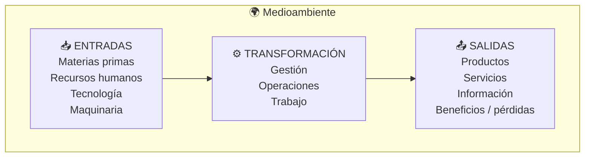
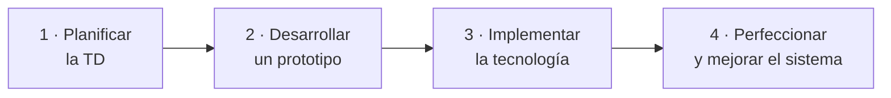
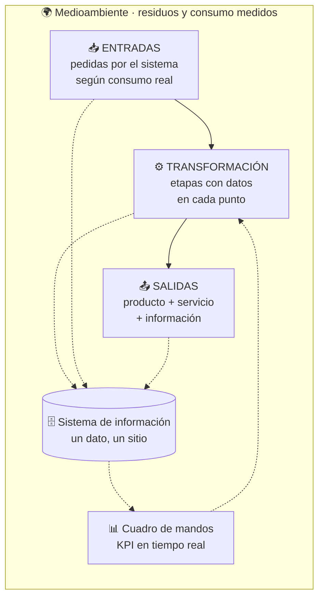

## UD5 · Apartado 3 — 📚 Fundamento

> **[Módulo: Digitalización Aplicada a los Sectores Productivos]** · **Unidad 5 de 5**
> 🧭 Índice del módulo: [[00_Indice_DASP]]
>
> **📍 Cuándo se lee:** es el contenido de la unidad. Lo vas a tener abierto casi las diez horas.

---

## 1 · EL PROBLEMA, ANTES QUE LA DEFINICIÓN

Una empresa de catering sirve comidas en varios comedores escolares. Cada comedor tiene **su propio almacén** y pide a la oficina central lo que le falta.

**Y pasa esto:** un comedor **está tirando cebollas** que le sobran mientras, ese mismo día, otro comedor **le pide a la oficina central que le compre cebollas**. La oficina central compra, porque **no sabe qué hay en cada comedor**.

> [!warning] Una distinción clave para empezar
> Pensar que el problema de esa empresa **es tecnológico**. No lo es. Nadie hace mal su trabajo: el cocinero tira lo que le sobra, el otro pide lo que necesita y administración compra al proveedor más barato.
>
> **El problema es que ninguno de los tres ve lo que ven los otros dos.**
>
> Y por eso un plan de transformación digital **no empieza eligiendo tecnología: empieza dibujando cómo funciona la empresa hoy**. Si no ves el circuito, no puedes saber dónde está el corte.

Ese caso está resuelto entero en [[UD5.6_Caso_Resuelto]].

---

## 2 · QUÉ ES LA TRANSFORMACIÓN DIGITAL

> [!important] Definición
> La **transformación digital (TD)** es el proceso de **usar las tecnologías digitales para transformar las empresas y los negocios**, de manera que sean **más competitivas** y estén **en sintonía con el mercado cambiante actual**.
>
> **Cambia completamente la forma en que la empresa funciona**, y persigue varios objetivos: optimizar los procesos, mejorar el servicio al cliente, mejorar la calidad y abaratar costes.

> [!danger] 🛑 Y lo primero que hay que aceptar
> **No todas las empresas son iguales ni necesitan el mismo grado de digitalización.** Cada una fija los objetivos del cambio tecnológico **según cómo funcione ella**.
>
> Un plan copiado de otra empresa no vale. Y esto no es una frase bonita: es el primero de los factores clave del apartado 5.

---

## 3 · LA EMPRESA CLÁSICA, A NIVEL DE BLOQUES · `CE.05.a`

El primer apartado de tu plan es **dibujar la empresa tal y como funciona hoy**. Y se dibuja siempre igual: **entradas → transformación → salidas**, con el **medioambiente** rodeándolo todo.

> [!info] Cómo se lee este esquema
> - **Entradas:** lo que la empresa mete en el circuito — materias primas, personas, tecnología, maquinaria.
> - **Transformación:** lo que hace con ello — gestión, operaciones, trabajo. Es **el interior de la empresa**, y es donde vive el hardware.
> - **Salidas:** lo que produce — productos, servicios, **información** y, al final, **beneficios o pérdidas**.
> - **El medioambiente** no es decoración: es el marco. De ahí salen los recursos y ahí van los residuos. **Es la UD1 mirando esta unidad por encima del hombro.**

> [!tip] 💡 Cómo se hace este diagrama para una empresa concreta
> No copies este esquema tal cual: **rellénalo con la empresa que hayas elegido**.
>
> 1. Escribe las **entradas reales**: ¿qué compra? ¿a quién? ¿cuánta gente trabaja?
> 2. Descompón la **transformación en etapas con nombre**: recepción, almacén, preparación, servicio, facturación…
> 3. Escribe las **salidas reales**: qué vende, a quién, y **qué información genera** *(esta última se olvida siempre y es la que más importa aquí)*.
> 4. Y marca **por dónde circula el papel, el teléfono y el WhatsApp**. Ahí es donde vas a intervenir.

---

## 4 · QUÉ SE DIGITALIZA · `CE.05.b` `CE.05.c`

### 4.1 · Por sectores

El libro repasa **cinco sectores clave**. Fíjate en que en cuatro de los cinco la respuesta empieza por lo mismo: **atender mejor y antes al cliente**.

| Sector | Qué se digitaliza | Datos y casos |
|---|---|---|
| **Atención al cliente** | Conectar al usuario con el servicio mediante **chatbots**. Si no encuentran la información, deben transferir la consulta a una persona | Resuelven consultas frecuentes de forma inmediata y en varios idiomas; los casos complejos necesitan escalado humano |
| **Atención médica** | Facilitar **pedir cita y resolver dudas administrativas**; *chatbots* disponibles en cualquier momento | El personal **se libera** de las preguntas frecuentes y se concentra en lo complejo. La IA **ayuda al diagnóstico** e informa de pruebas de imagen o analíticas |
| **Banca** | **Banca online y asistentes virtuales** para las operaciones rutinarias: pagar un recibo, domiciliar | Al reducir costes de personal, el banco puede ofrecer **mejor servicio e incluso comisiones**. Y cuando una consulta **escala a un empleado, le llega contextualizada**. Caso: **Bradesco Bank**, +5.000 sucursales en Brasil, asistente entrenado en portugués |
| **Seguros** | **Atención inmediata y seguimiento en tiempo real**: un coche parado en la autopista, una fuga de agua, un incendio en una cocina | Comunicación coordinada entre usuario, reparador, perito y compañía. Los *chatbots* usan **CNL** *(comprensión del lenguaje natural)* y se conectan con los sistemas internos para informar del estado del expediente |
| **Automoción** | **IAG** *(IA generativa)* en robots y en los propios vehículos | Los pilotos automáticos **todavía no son del todo satisfactorios** por la cantidad de parámetros a controlar. Cuando se depure, **el software se impondrá a la mecánica y la electrónica**. Tesla usa **cámaras**; otras marcas añaden **lídar** |

### 4.2 · Por departamentos

Y ahora la parte que más te toca, porque son **los departamentos de una empresa administrativa**:

> [!example] 🛎️ Comercial y atención al cliente
> **Objetivo:** aumentar la **tasa de resolución en el primer contacto** — un buen servicio genera confianza **y ventas**.
>
> Con *chatbots* basados en IA que usan **machine learning** y **CNL**. Sus ventajas:
> 1. **Acelera el tiempo medio de gestión** de los recursos humanos disponibles.
> 2. Resuelve las consultas sencillas para que **los agentes lleven las complejas**.
> 3. Puede darle al agente **un informe breve de las necesidades del cliente antes de la llamada**.
> 4. Crea una **base de datos de conocimiento** con las preguntas más habituales y su resolución.
> 5. Permite **analizar indicadores críticos y KPI** para mejorar el departamento.

> [!example] 👥 Recursos Humanos
> Ahorrar tiempo en tareas rutinarias para que el personal se dedique a lo que **añade valor**.
>
> Un *chatbot* de RR. HH. resuelve preguntas habituales de la plantilla —**vacaciones, permisos, planes de jubilación, prestaciones**— e incluso gestiona **desplazamientos**: reservas de hotel o vuelos, informes de gastos.

> [!example] 📣 Marketing
> Herramientas de análisis potentes para:
> - **Comprender la experiencia de compra** de los clientes.
> - Analizar sus datos para **mejorar las campañas de e-mail marketing**.
> - Valorar los comentarios para **verificar si los chatbots funcionan bien**.

> [!example] 💶 Finanzas y Contabilidad
> Puede beneficiarse de **blockchain, aprendizaje automático e IA**. Un buen sistema automatiza parte de las tareas administrativas rutinarias, reduce errores de transcripción y deja más tiempo para análisis y control.
>
> En concreto permite:
> - **Generar facturas más rápido**, eliminando costes de personal.
> - **Reducir a la mitad el tiempo de cobro** de las facturas.
> - **Evitar penalizaciones** gestionando los impuestos más rápido.
> - **Adecuar las operaciones** a los nuevos planes contables o a lo que exija la ley.
> - **Mejorar el análisis y la planificación financiera**.

> [!quote] Un caso pequeño que enseña más que uno grande
> Una tienda que vende en varios países puede usar un asistente virtual para responder preguntas frecuentes en distintos idiomas y derivar los casos complejos. Lo importante no es el volumen de conversaciones, sino medir resolución, derivación, tiempo de respuesta y satisfacción.
>
> No es una multinacional tecnológica: es una empresa de pegatinas.

---

## 5 · CÓMO SE HACE LA TRANSFORMACIÓN

### 5.1 · Las cuatro etapas

**Lo habitual** es plantear una **hoja de ruta** con todos los proyectos que se van a implementar a lo largo del tiempo, teniendo en cuenta las **etapas, las prioridades, las oportunidades y las capacidades** de la empresa, además de su estrategia y sus objetivos.

> [!important] Y lo primero de todo: el **nivel de madurez digital**
> El proceso *«depende del nivel de madurez digital de la empresa antes de comenzar»*. No se empieza por el mismo sitio en una empresa que ya trabaja con un ERP que en una que lo lleva todo en papel.

### 5.2 · Los ocho factores clave

> [!abstract] Lo que hay que evaluar antes de escribir una línea del plan
> | Factor | Qué significa |
> |---|---|
> | **Cada empresa es diferente** | Cada sector tiene necesidades específicas: el plan de una empresa de aceite de oliva **no se parece** al de una compañía de seguros |
> | **Actitud frente al cambio** | Habrá más problemas en una empresa **estática y poco flexible** que en una dinámica |
> | **Objetivos y estrategia** | El plan digital se crea **para satisfacer la estrategia de la empresa**, no al revés |
> | **Nivel de madurez digital** | Un banco o una aseguradora suele estar un peldaño por encima de una empresa agroalimentaria |
> | **Tecnología preexistente** | No es lo mismo partir de **nivel cero** que de una cultura digital ya asentada, con personal formado y software instalado |
> | **Presupuesto** | Requiere **un presupuesto elevado**: hay que **cerciorarse de que se tienen los recursos** antes de empezar |
> | **Velocidad de implantación** | La marcan los objetivos; puede ser más o menos rápida |
> | **Motivación y riesgos** | Van a aparecer retos y riesgos que pueden **retrasar el proceso o hacerlo fracasar** |

### 5.3 · Los seis paradigmas

> [!important] Un **paradigma** es un modelo
> Del glosario del capítulo: *teoría o conjunto de teorías que sirven como modelo; se utiliza para resolver problemas*. Elegir paradigma es elegir **cómo se va a organizar el trabajo**.

| Paradigma | Cómo funciona | Cuándo encaja |
|---|---|---|
| **Clásico, en cascada o por etapas** | Etapas sucesivas, cada una con **objetivos concretos y su *deadline***, y cada una **parte del trabajo de la anterior** | Es de los más habituales; sirve cuando el destino está claro |
| **Evolutivo** | **No se hace de golpe:** se trabaja por ciclos, y **cada ciclo es la evolución del anterior** | Cuando se quiere ir ajustando el resultado **sin grandes contratiempos** |
| **Por componentes** | La TD se descompone en **bloques pequeños** que después **se ensamblan como un juego de construcción** | Cuando el sistema es grande y se puede trocear |
| **Basado en la innovación** | Conjuga la TD con **experimentación y creatividad**, para identificar **nuevas oportunidades de negocio** y nichos | **No sirve para todo tipo de negocio** |
| **Basado en metodologías ágiles** | Parecido al de componentes: resultados pequeños, trabajo **coordinado y colaborativo** entre personas y departamentos, y **feedback de cada fase** | Viene del **desarrollo de software**; prioriza **adaptarse a los cambios del mercado** |
| **Por fases de maduración** | Se transforman **primero unos departamentos** y, cuando la empresa está preparada, se aborda el resto | Cuando el nivel de madurez es desigual dentro de la casa |

> [!tip] 💡 Los dos que más se parecen, y cómo distinguirlos
> **Por componentes** y **ágiles** trocean los dos. La diferencia está en el porqué: el de **componentes** trocea para **poder abordarlo**; el **ágil** trocea para **poder corregir el rumbo** con el *feedback* de cada trozo.
>
> Y no confundas **evolutivo** (ciclos, cada uno mejora del anterior) con **por fases de maduración** (departamentos, uno detrás de otro).

---

## 6 · CONECTAR LO DIGITALIZADO CON EL RESTO · `CE.05.d`

> [!warning] 📌 Este apartado está desarrollado por mí
> El libro trata la conexión **de forma implícita**, dentro de los casos y al hablar de ERP y de herramientas de colaboración. Pero `CE.05.d` es un criterio con nota propia, así que aquí va explícito.

**Un plan queda incompleto** cuando digitaliza una etapa **y la deja aislada**: una tienda online que no habla con el almacén, un chatbot que no ve el estado del pedido. **Eso no reduce trabajo: lo duplica**, porque alguien tiene que copiar los datos de un sitio al otro.

> [!abstract] Las cuatro preguntas que resuelven la conexión
> Por cada etapa que digitalices, contesta:
> | # | Pregunta |
> |---:|---|
> | 1 | **¿De dónde saca los datos?** ¿Quién los mete y cuándo? |
> | 2 | **¿A quién se los pasa?** ¿Qué otra etapa los necesita? |
> | 3 | **¿Qué pasa si falla?** ¿Se puede seguir trabajando a mano? |
> | 4 | **¿Quién puede verlos?** No todo el mundo tiene que ver todo |

**Las tres piezas que hacen la conexión posible:**

| Pieza | Qué hace |
|---|---|
| **ERP** *(enterprise resource planning)* | El programa de **gestión integral**: compras, almacén, ventas y contabilidad **compartiendo los mismos datos**. Es la respuesta más habitual a la pregunta *«¿cómo lo conecto todo?»* |
| **Herramientas de colaboración** | **Slack o Teams** para comunicación · **Trello o Asana** para planificación · **Expense Point** para gastos · **Striven** para gestión empresarial. El libro las cita como forma de **mejorar la colaboración interdepartamental**, que hace a la empresa *«mucho más productiva que una empresa individualista»* |
| **Cuadro de mandos** | Una pantalla con **los KPI y los datos importantes**, accesible **no solo a gerencia**, sino a quien trabaja con ellos |

> [!success] El principio, en cuatro palabras
> **Un dato, un sitio.** Si el mismo dato se teclea dos veces, la conexión está mal hecha.

---

## 7 · EL DIAGRAMA DEL SISTEMA DIGITALIZADO · `CE.05.e`

El segundo diagrama del plan. **Mismo esquema, empresa distinta**: sobre los bloques de la empresa clásica, se añade **la capa de datos**.

> [!important] Qué tiene que verse en tu segundo diagrama y no en el primero
> 1. **De dónde salen los datos** en cada etapa.
> 2. **Dónde se guardan** — y aquí decides cloud, edge, fog o mist, que es la UD3.
> 3. **Quién los consulta**, incluido el cuadro de mandos.
> 4. **Qué decisión se toma con ellos** — si un dato no cambia ninguna decisión, sobra.
>
> **Si tu segundo diagrama es el primero con más colores, vuelve a empezar.**

---

## 8 · VIABILIDAD, MEJORAS Y MÉTRICAS · `CE.05.f`

### 8.1 · Para qué se hace un plan: los siete resultados esperados

> [!success] Lo que se busca obtener
> 1. **Mejorar la experiencia y la fidelización del cliente** — muchas veces es el objetivo principal.
> 2. **Reducir costes**, para poder ofrecer mejores precios. Viene de mejorar los procesos y de automatizar (*chatbots* y otras herramientas de IA: **hace falta menos mano de obra**).
> 3. **Mejorar la eficiencia de los procesos**.
> 4. **Obtener ventajas competitivas** — el ejemplo del libro: una fábrica de muebles que usa **realidad aumentada** para enseñar cómo queda el mueble en casa del cliente.
> 5. **Mejorar el rendimiento del personal**: si el *chatbot* resuelve parte de las solicitudes repetitivas y deriva bien las complejas, el equipo puede dedicar más tiempo a tareas que requieren criterio y trato humano.
> 6. **Más agilidad y menos tiempo de respuesta** en un mercado cambiante — hay casos en que la espera del cliente baja **a menos de dos minutos**.
> 7. **Mejorar la colaboración**, con ERP y herramientas corporativas.

> [!danger] 🛑 Y el punto 2 hay que decirlo entero
> *«Se necesita, por ejemplo, menos mano de obra.»* Esa frase está en el libro y **no se puede esconder al escribir un plan**.
>
> Un plan honesto dice **qué puestos cambian**, cuáles dejan de hacer falta y **qué formación se ofrece** a esas personas. Por algo `CE.05.h` habla de recursos y el RA5 termina diciendo *«indicando cómo afectaría a los recursos humanos»*.

### 8.2 · Cómo se mide que ha funcionado

> [!abstract] Las seis métricas de la transformación digital
> 1. **Medir la experiencia del cliente** — por ejemplo, con una encuesta de satisfacción.
> 2. **Analizar el coste de la TD y compararlo con el beneficio obtenido.**
> 3. **Calcular la productividad de los empleados** y compararla con la anterior a la TD.
> 4. **Evaluar la fiabilidad** de los sistemas o los servicios.
> 5. **Medir la calidad** de los productos.
> 6. **Calcular el rendimiento** del sistema.

> [!important] La regla de oro de la viabilidad
> *«Los resultados de la transformación tienen que superar a los costes de forma clara y significativa, pues **no tiene sentido emprender un proceso de TD si los costes exceden a los beneficios**.»*
>
> Eso es, literalmente, lo que tiene que demostrar tu informe de viabilidad.

---

## 9 · PRODUCCIÓN Y RESIDUOS · `CE.05.g`

> [!important] 📌 Conexión con la UD1
> `CE.05.g` exige analizar la mejora en la producción y la gestión de residuos. Para hacerlo se recupera el fundamento de economía circular de la UD1 y se aplica a la empresa elegida.

**La pregunta que hay que contestar en el plan:** ¿qué residuo genera hoy esta empresa **porque no sabe algo**?

| Residuo | El dato que falta | Qué lo elimina |
|---|---|---|
| **Producto que caduca sin venderse** | Cuánto hay y desde cuándo | Control de existencias con **FEFO** *(lo que caduca antes, sale antes)* |
| **Compra de lo que ya se tiene en otro sitio** | Qué stock hay en cada punto | **Almacén centralizado** — es literalmente el caso del catering |
| **Producto defectuoso que llega al cliente** | En qué punto se estropea | **Sensores y visión artificial** en línea (UD2) |
| **Papel, impresión y desplazamientos** | — | Digitalización documental y **teletrabajo** (UD3) |
| **Energía** | Cuánto consume cada equipo y cuándo | **Sensorización + KPI de consumo** |

> [!success] Cómo se redacta este apartado del plan
> Tres columnas: **residuo que se genera hoy** · **cuánto** *(aunque sea una estimación, dilo)* · **qué se reduce y con qué medida**.
>
> Y el cierre: **relacionarlo con la economía circular de la UD1**. Reducir residuo por falta de información es **la erre número 3 —reducir—**, y está muy por encima de reciclar.

---

## 10 · EL DOCUMENTO FINAL · `CE.05.h`

### 10.1 · Qué es un plan de transformación

> [!important] La definición del libro
> **El documento donde se explica en detalle cómo la organización evolucionará y se adaptará** a las condiciones del mercado, los avances tecnológicos que va a adoptar y los cambios de infraestructura que abordará.
>
> Es **la hoja de ruta**: especifica los pasos que debe dar la organización para **pasar del estado actual a un estado futuro ideal**.

### 10.2 · Qué tiene que incluir, con sus mínimos

> [!danger] 🛑 Los mínimos son del libro y son verificables
> | Elemento | Mínimo | Qué es |
> |---|:---:|---|
> | **Áreas** que deben evolucionar tecnológicamente | **3** | Con objetivos propios para cada departamento (recursos humanos, finanzas…) |
> | **Objetivos** que se quieren conseguir | **6** | Tienen que ser **alcanzables y medibles**. Por ejemplo: optimizar la eficiencia de las operaciones, mejorar la satisfacción del cliente, motivar a los empleados |
> | **KPI** | uno por objetivo | Indicadores medibles que dicen si se están cumpliendo. Ejemplos del libro: *la espera al teléfono pasa de **3 minutos a 30 segundos***; *la entrega de un pedido baja de **5 días laborables a 3*** |
> | **Proyectos** | los que hagan falta | Se relacionan con los objetivos: **su propósito es que se cumplan** |
>
> **Tres áreas y seis objetivos son el suelo, no el techo.** Un plan con dos objetivos está incompleto por definición.

### 10.3 · Los seis recursos que hay que desplegar

| Recurso | Lo que dice el libro |
|---|---|
| **El equipo humano** | *«Lo más importante no es solo la idea, sino la idea más la ejecución.»* Y como **a la gente no suelen gustarle los cambios**, hacen falta **líderes dentro de la empresa que estén a favor** y contagien esa motivación |
| **Participación de proveedores y usuario final** | Que **prueben el prototipo** y den *feedback*. Esa información es **vital para reconducir el proyecto** cuando algo falla |
| **Formación** | Capacitación y **entrenamiento continuo**; que se acostumbren a las **metodologías ágiles** y estén motivados |
| **Recursos financieros** | Contar con ellos **antes de empezar**, y que los resultados **superen claramente a los costes** |
| **Software** | **La base de toda TD**: colaboración, compartir archivos, gestión web, gestión integral. A veces **un software innovador es la punta de lanza** — el caso de **Sephora** y su programa que detecta el tono de piel |
| **Hardware** | No solo ordenadores: **también el resto de máquinas, como los robots** |

> [!tip] 🧭 Los tres ejes de la TD
> El libro los deja caer casi de pasada, y resumen la unidad entera: **software, hardware y la web (o el cloud)**.

### 10.4 · Y la parte que el RA nombra y casi nadie escribe: las personas

> [!important] El RA5 termina así: *«…e indicando cómo afectaría a los recursos humanos»*
> No es un añadido decorativo. Tu documento final tiene que decir:
> - **qué puestos cambian** de tareas,
> - **qué formación** recibe cada uno,
> - **quién lidera** el cambio dentro de la empresa,
> - y **cómo se mide** si la plantilla lo está adoptando o lo está sufriendo.
>
> El propio libro apunta hacia dónde va esto en su apartado sobre **trabajo flexible**: jornadas reducidas o flexibles para quien tiene hijos o personas a cargo; y un futuro donde *«lo importante será poder medir el rendimiento de los empleados y que estos tengan más autonomía»*. Y remata con algo muy práctico: **si un trabajador que rinde no se ve valorado, cambia de trabajo**.

---

> [!summary] 🎓 Lo que te llevas de aquí
> - Un plan **no empieza por la tecnología**: empieza dibujando **cómo funciona hoy** la empresa.
> - Toda empresa clásica se dibuja igual: **entradas → transformación → salidas**, dentro del medioambiente.
> - Hay **seis paradigmas** para organizar el cambio; el clásico va **en cascada** y el evolutivo **por ciclos**.
> - Digitalizar una etapa y dejarla suelta **duplica el trabajo**. La conexión se resuelve con **ERP, herramientas de colaboración y un cuadro de mandos**: *un dato, un sitio*.
> - Un plan sin **KPI, coste y beneficio** no es un plan.
> - Mínimos del documento: **3 áreas, 6 objetivos medibles, sus KPI y sus proyectos**.
> - Y el RA lo exige explícitamente: **hay que decir cómo afecta a las personas**.
>
> **Siguiente:** [[UD5.4_Lo_Que_No_Es]]

---

| ← Anterior | 🧭 Índice | Siguiente → |
| :--- | :---: | ---: |
| [[UD5.2_Donde_Estamos]] | [[00_Indice_DASP]] | [[UD5.4_Lo_Que_No_Es]] |
